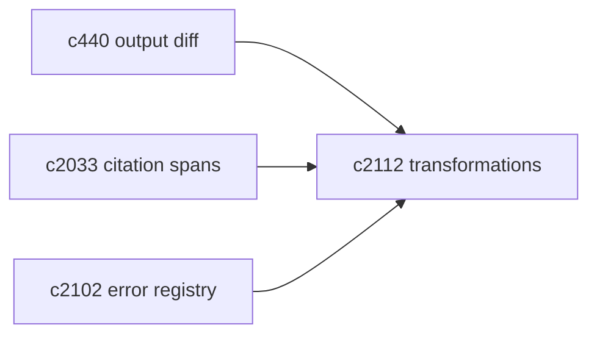
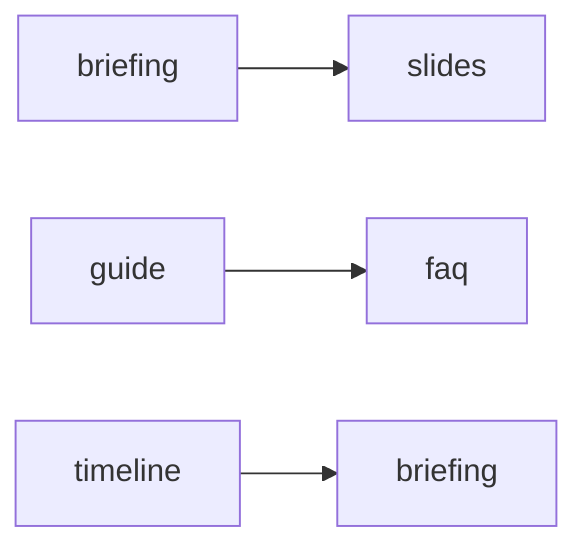

## Why

用户手里往往已经有一个不错的结果，但想换一种表达方式：briefing 改成 slides，guide 改成 FAQ，timeline 改成 briefing。现在最直接的办法是“重新生成”，但这会带来两个问题：

- 成本高：又要跑一次检索与生成。
- 不稳定：同样的输入可能得到不同内容，原来的好东西丢了。

更好的路径是“结果到结果”的转换：尽量复用既有结构与证据，只做必要的重排与补齐。

## What Changes

- 定义 transformation contract：
  - 支持哪些输出类型之间的转换
  - 转换需要哪些中间结构（outline/sections/qa pairs 等）
  - citation 如何保留与映射（对齐 `c2033/c2034`）
- 先做高频的三条转换：
  - briefing → slides
  - guide → FAQ
  - timeline → briefing
- 转换失败要能解释：
  - 缺字段、引用不足、结构不合规等，走统一错误码（对齐 `c2102`）

## Capabilities

### New Capabilities

- `cross-type-result-transformations`: 输出结果的跨类型转换契约与实现路径。

### Modified Capabilities

- `output-diff-compare-and-version-review`（`c440`）：转换前后需要可对比。
- `citation-span-mapping-and-source-viewer-highlights`（`c2033`）：转换后引用仍要能定位到证据。

## Impact

- UX：减少“再赌一次”；让已有成果更耐用。
- Backend：需要一层中间结构与转换器注册表，但可以逐步做，先从最常见的开始。

## Dependency Sketch

