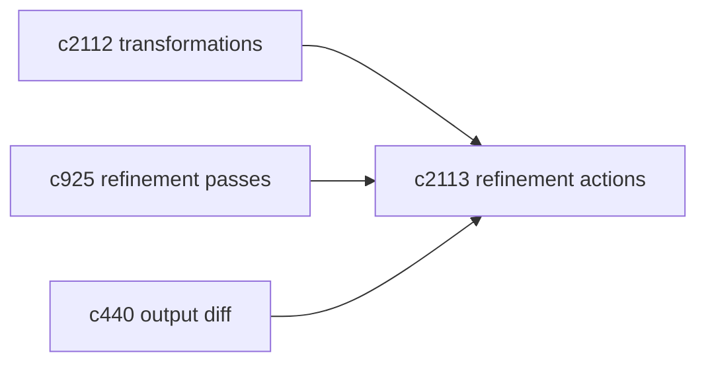
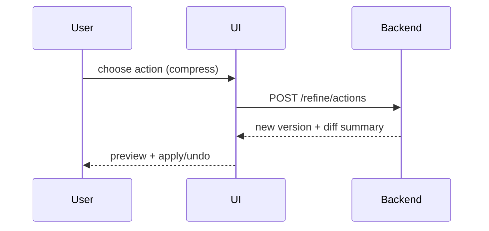

## Why

“精修”如果只靠一次性重写，风险很高：你很难控制它改了哪里，也很难保证引用不会掉。更像编辑的方式是提供一组小动作：我想压缩一段、我想补证据、我想把段落拆成要点。

这条提案做的是“动作库”：把精修拆成可理解、可组合、可回滚的小步骤。

## What Changes

- 定义 refinement actions（最小动作集）：
  - rewrite_title / compress_paragraph / split_section / bullets_from_paragraph
  - add_citations / tighten_claims（把“像结论但没证据”的句子收敛）
- actions 与 OutputType/GenerationType 绑定：
  - 不同输出允许不同动作，避免改完无法渲染（对齐 `c2110`）
- 结果可对比：
  - 至少能看到“哪些段落变了/引用有没有减少”（对齐 `c440`）

## Capabilities

### New Capabilities

- `structural-refinement-action-library`: 结构化精修动作库与动作契约。

### Modified Capabilities

- `cross-type-result-transformations`（`c2112`）：转换后的结果也需要可精修。
- `longform-rewrite-passes-and-structural-refinement`（`c925`）：把“pass”落成可执行动作。
- `output-diff-compare-and-version-review`（`c440`）：精修前后差异展示。

## Impact

- UX：精修更可控，用户更知道自己在改什么。
- Engineering：可测试面更清晰，减少“看起来差不多”的无效迭代。

## Dependency Sketch

