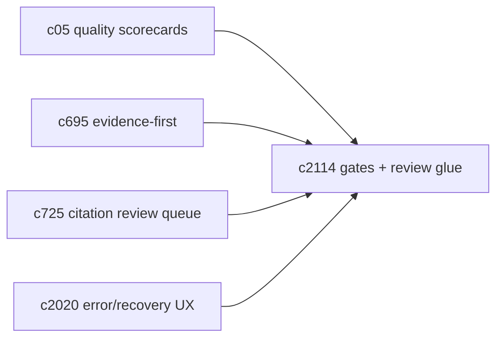
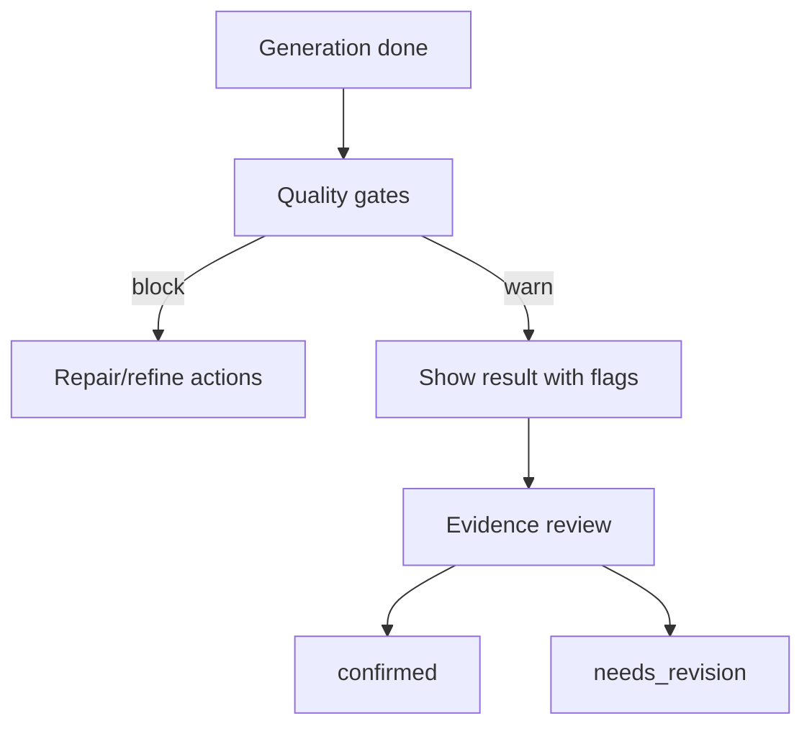

## Why

质量门（自动检查）和证据审阅（手动确认）应该是两种不同的东西：前者帮你避免明显坏结果，后者帮你决定“我信不信”。问题在于，如果两者没有连接点，用户感受会很割裂：

- 有时系统特别严格，直接挡住；有时又完全放任，用户不知道哪里该警惕。
- 审阅入口藏得很深，只有很认真的人会点。

这条提案不想做重流程，只想把边界与连接点写清楚，并让 UI 能自然承载它。

## What Changes

- 定义质量门分级（最小集合）：
  - 阻断：结构不合规、关键字段缺失（否则渲染必炸）
  - 警告：引用率偏低、来源不足、长度偏差
- 定义 evidence review 的最小状态机：
  - draft → pending_review → confirmed / needs_revision
  - 质量门的 warning 触发“建议审阅”，但不强制
- 把质量信号接到输出展示：
  - 结果仍可看，但带清晰的标记与建议动作（对齐 `c2020`）

## Capabilities

### New Capabilities

- `quality-gates-and-evidence-review-glue`: 质量门分级 + 审阅状态机 + UI 承载。

### Modified Capabilities

- `quality-scorecards-and-eval-center`（`c05`）：质量门是 scorecard 的一部分输入。
- `evidence-first-generation-modes-and-unsafe-claim-brakes`（`c695`）：不安全主张的刹车需要有 UI 落点。
- `inline-citation-review-queue-and-fix-sweeps`（`c725`）：审阅队列与修复动作需要能串起来。

## Impact

- UX：用户更容易知道“这份结果哪里不稳”和“我下一步该做什么”。
- Risk：别把门槛做成阻碍；阻断只用于“必炸”的情况，其他都走警告。

## Dependency Sketch

