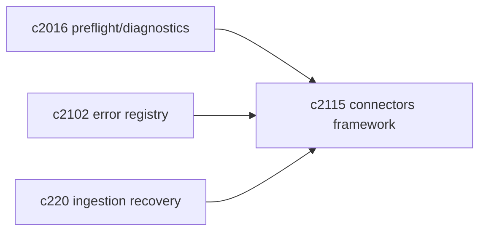
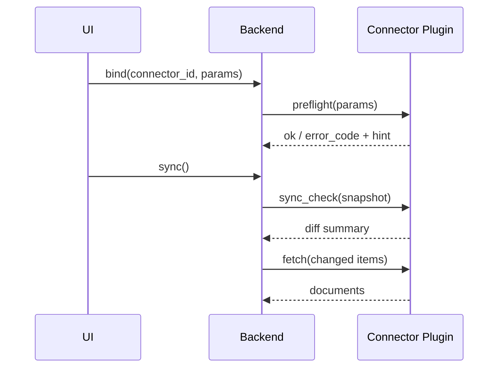

## Why

来源连接器是个人知识库的入口。现在项目里已经出现 connectors 相关代码与诊断方向，但如果没有一个清晰的框架边界，后续每加一个连接器都会复制一遍“绑定/快照/同步/诊断”的流程逻辑，最后越修越累。

我希望宿主提供通用流程与 UI；连接器只负责“怎么读你的数据”，并且把失败说成人话。

## What Changes

- 定义 `SourceConnectorPlugin` 契约：
  - binding：必要参数与验证
  - snapshot：一次同步的基线（用于增量）
  - sync_check：给出变更摘要（added/modified/deleted + reason）
  - fetch：按需拉取内容与元数据
- 宿主提供通用 UI 与任务流：
  - bind / preflight / dry-run / sync / retry
  - 失败走统一错误码（对齐 `c2102`）
- 把 connectors 的诊断与预检接入同一套报告结构（对齐 `c2016`）。

## Capabilities

### New Capabilities

- `source-connectors-framework`: 连接器插件契约、宿主通用流程与 UI 边界。

### Modified Capabilities

- `source-connectors-preflight-and-sync-diagnostics`（`c2016`）：诊断从“某个连接器特例”变成框架能力。
- `source-ingestion-retry-recovery-and-partial-success`（`c220`）：同步的部分成功/重试语义需要落地到连接器框架。

## Impact

- UX：新增来源更像“接插件”，不再每次都重做一遍 UI。
- Engineering：连接器新增成本更低，错误更一致，排查更快。

## Dependency Sketch

