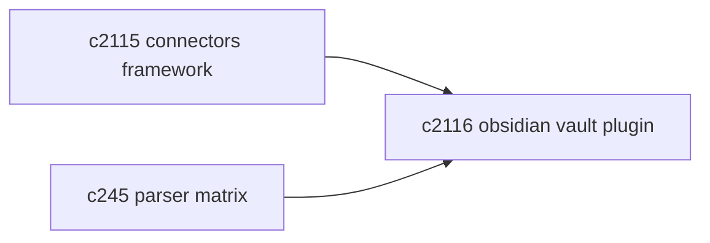
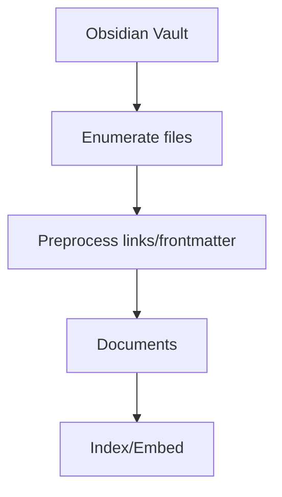

## Why

对个人用户来说，Obsidian vault 往往是最成熟的知识库形态：链接关系多、笔记结构稳定、内容更新频繁。如果 Crystalith 不能把它接进来，就等于让用户在“迁移”和“放弃”之间二选一。

这条提案不做宏大叙事，只做一个能用的 vault 连接器，并用它验证 `c2115` 的框架是不是足够通用。

## What Changes

- 实现 Obsidian vault 连接器（作为 `SourceConnectorPlugin`）：
  - vault 路径绑定与权限检查
  - 文件枚举与过滤（md/图片/附件的策略可配置，但先从 md 起）
  - 增量检测：mtime/hash（避免全量重跑）
- 预处理与元数据：
  - 解析 wikilink/embed/frontmatter，保留 link graph 信息到 metadata
  - 对引用/嵌入做可追溯展开（避免“看起来缺一块”）
- 同步前预估：
  - 先给出会导入的文件数、预计 chunk 数、预计耗时区间（别让用户硬等）

## Capabilities

### New Capabilities

- `obsidian-vault-source-connector-plugin`: Obsidian vault 连接器插件。

### Modified Capabilities

- `source-connectors-framework`（`c2115`）：vault 是第一个强验证者。
- `parser-capability-matrix-and-format-fallbacks`（`c245`）：md 解析与 fallback 需要对齐能力矩阵。

## Impact

- UX：把用户已有的“日常笔记”直接变成可检索、可生成的来源。
- Risk：vault 规模差异很大；必须把预估与 dry-run 做好，避免第一次就把人吓跑。

## Dependency Sketch

