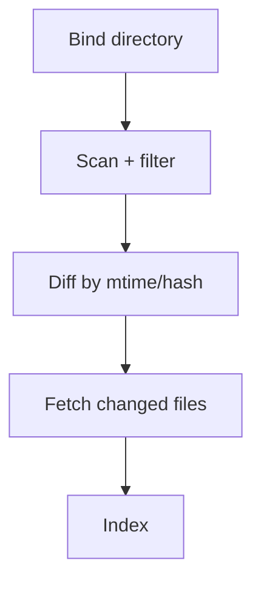

## Why

如果连接器框架只在 Obsidian 上跑通，很容易变成“为一个产品特例写的框架”。要验证它是真框架，需要一个成本低、语义简单、但覆盖关键流程的第二连接器。本地目录就是最合适的基线。

它还有一个现实价值：很多人不想把资料塞进某个笔记软件，只想指一个文件夹。

## What Changes

- 实现 Local Directory 连接器：
  - 目录绑定与权限检查
  - 文件过滤规则（扩展名、大小上限、忽略模式）
  - 增量检测（mtime/hash）
- 支持 dry-run：
  - 同步前先列出会导入哪些文件、预计 chunk 数、潜在风险（超大文件、不可解析格式）

## Capabilities

### New Capabilities

- `local-directory-source-connector-plugin`: 本地目录来源连接器插件。

### Modified Capabilities

- `source-connectors-framework`（`c2115`）：用第二连接器验证框架复用性。

## Impact

- UX：门槛更低；不用迁移到某个工具就能接入资料。
- Engineering：能更早暴露框架问题（过滤、增量、错误表达）。

## Dependency Sketch

