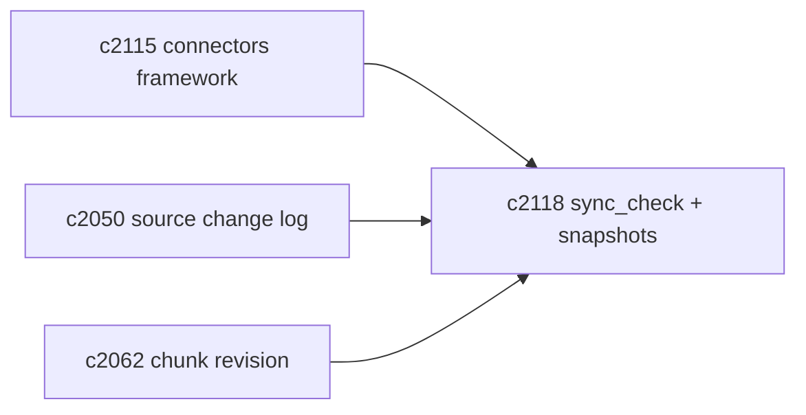
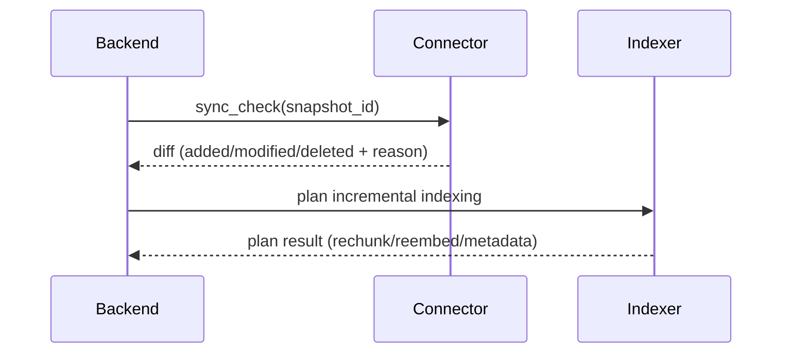

## Why

“同步”如果只有一个按钮，用户会越来越不信任：我明明只改了两篇，为什么它又跑了半小时？我删了一个文件，为什么检索里还搜得到？这些问题本质上都是缺少一件事——系统没有把“变更”说清楚。

这条提案把 sync_check 的语义与 snapshot 的边界补齐：同步不是黑盒重跑，而是对差异做解释、对基线可追溯。

## What Changes

- 明确 sync_check 的输出结构：
  - added/modified/deleted 的条目列表
  - 每条变化的 reason：hash_change / mtime_change / path_rename / parse_failed 等
- 引入 snapshot id 语义：
  - 每次同步都生成 snapshot id，作为下次 sync_check 的基线
  - 支持回滚/对账：至少能回答“这次同步相对哪次变了什么”
- 与索引层对齐变化策略：
  - 哪些变化需要重切分（对齐 `c2062`）
  - 哪些只需重嵌入
  - 哪些只改 metadata

## Capabilities

### New Capabilities

- `connector-sync-check-diff-and-snapshot-semantics`: sync_check diff 与 snapshot 语义定义。

### Modified Capabilities

- `source-change-log-and-delta-indexing-planner`（`c2050`）：变更日志与增量索引策略需要打通。
- `chunk-revision-ids-and-delta-rechunking`（`c2062`）：重切分需要 revision 语义承接。
- `source-connectors-framework`（`c2115`）：sync_check 成为框架的标准能力。

## Impact

- UX：同步更可解释；用户更敢用增量，不必每次全量重跑。
- Engineering：为后续的性能优化与一致性修复提供抓手。

## Dependency Sketch

