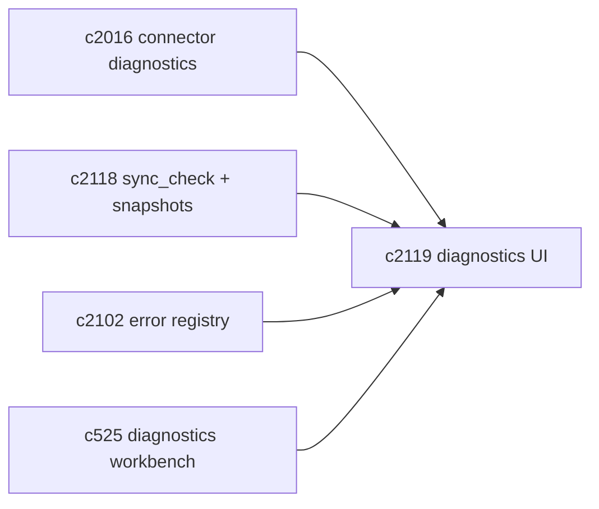
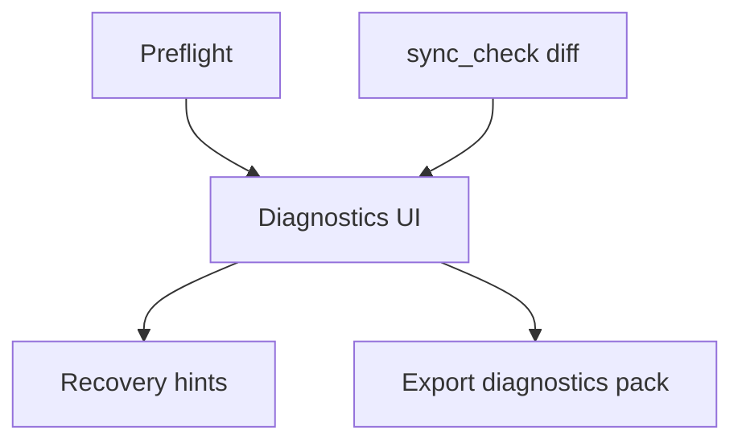

## Why

连接器失败的原因往往不是“坏了”，而是“权限不够、路径不对、过滤规则太狠、解析器缺失”。如果 UI 不能把原因说成人话，用户就会把它当成不稳定的实验功能，然后不用了。

这条提案做的是诊断与自救体验：把 preflight/sync_check 的信息用一致方式呈现，并给出能执行的提示。

## What Changes

- workspace 中新增 connector diagnostics 视图：
  - 连接器状态：已绑定/未绑定、上次同步、上次错误、恢复建议
  - preflight 结果与 sync_check diff 的统一呈现（对齐 `c2016/c2118`）
- 错误提示“人话化”：
  - 基于 `error_code` 给出具体操作建议（对齐 `c2102`）
  - 不把堆栈直接甩给用户，必要时提供“展开详情”
- 一键导出“诊断包”（不含隐私正文）：
  - 只包含结构、错误码、版本信息、统计信息，便于自查或提 issue（对齐 `c525`）

## Capabilities

### New Capabilities

- `connector-diagnostics-ui-and-recovery-hints`: 连接器诊断 UI、恢复提示与诊断包导出。

### Modified Capabilities

- `source-connectors-preflight-and-sync-diagnostics`（`c2016`）：诊断信息需要有 UI 承载。
- `dev-diagnostics-workbench-and-state-dumps`（`c525`）：诊断包与状态转储需要对齐结构。
- `error-code-registry-and-api-error-shape-enforcement`（`c2102`）：恢复提示的单一真相。

## Impact

- UX：连接器更“可用”，失败也不至于让人摸不着头脑。
- Engineering：现场问题更容易复现；减少“我这里不行但不知道为什么”的无效沟通。

## Dependency Sketch

