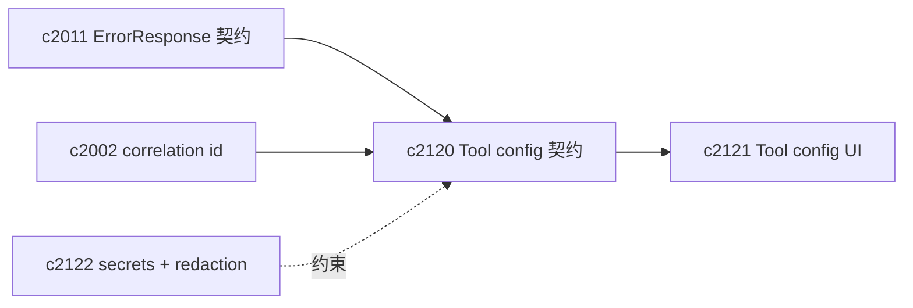

## Why

现在 `/v1/workspace/tools` 已经能把工具列表、默认 prompt、render/config schema 都吐出来，但“配置值”这件事仍然是悬空的：前端只能靠本地状态记住用户的选择，或者干脆不提供配置入口。

这会带来两个直接问题：

- 用户换浏览器/换 profile/刷新后，工具配置回到默认，体验像“每次都重新上手一遍”
- 后端插件和前端 UI 很难约定“哪些配置会影响生成”，也就更难做诊断、复现和回滚

这条提案把 tool config 变成一等对象：有稳定 shape、有读写接口、有版本与审计。

## What Changes

- 定义 `ToolConfig` 契约（workspace scope）：
  - identity：`tool_id`（与 OutputType / slides workflow 对齐）
  - value：一份稳定的 `config` JSON（严格校验，拒绝未知字段）
  - bookkeeping：`revision`、`updated_at`、`updated_by`（可先空）、`correlation_id`
- 增加最小读写接口：
  - `GET /v1/workspace/tool-config`：批量获取当前配置（带 redacted 标记，详见 `c2122`）
  - `PUT /v1/workspace/tool-config/{tool_id}`：更新配置（可选携带 `revision` 做乐观并发）
  - `POST /v1/workspace/tool-config/{tool_id}:reset`：重置为默认
- 错误与恢复动作：
  - 所有失败返回 `ErrorResponse`（`c2011`），并且尽量给出可执行 hint（例如“此字段不支持该选项”）
- 先不做跨设备同步：
  - 配置持久化可以落在本地 DB（sqlite）或简单文件存储，先让“同一 workspace 内可记住”成立
  - 如果以后要做跨设备，再接入 `workspace-api-contract` 的用户偏好层

## Capabilities

### New Capabilities

- `workspace-tool-config-persistence-contract`: tool config 的模型、校验、读写、审计与错误契约。

### Modified Capabilities

- `workspace-api-contract`: workspace tools 与 tool config 的组合输出需要稳定（避免 UI 端拼接地狱）。
- `openapi-error-contract-and-doc-gates`: 新接口必须纳入错误契约与 drift gate。（`c2011`）
- `request-context-and-correlation-ids`: 更新配置时要贯穿 correlation_id。（`c2002`）
- `ui-event-idempotency-and-shared-state-merge-contract`: 未来如果做并发编辑/合并，沿用同一套语义。（`c2012`）

## Impact

- Backend：新增 tool config store（先简单），并把校验/错误都收口到统一管道。
- Frontend：可以稳定读取/写入配置，为后续 `c2121` 的配置 UI 打底。
- Generated artifacts：
  - SSOT：后端 OpenAPI
  - 生成入口与 drift gate：沿用 `c2011` 定义的 `just api-export` / `just api-check`
  - 前端同步：沿用 `cd frontend/web && pnpm run api:sync`

## Dependency Sketch

