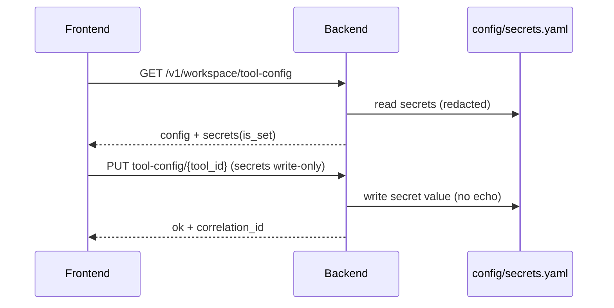

## Why

工具配置一旦进入“可编辑”，迟早会遇到敏感字段：API key、endpoint token、cookie、甚至某些 connector 的凭证。现在系统里已经有 `config/secrets.yaml` 与日志脱敏方向，但 tool config 这条线如果不先立规矩，很容易出现两种事故：

- UI/接口把 secret 当普通字段返回，日志/诊断包里也跟着泄露
- UI 保存时把占位符写回去，反而把真实 secret 覆盖掉

这条提案只做一件事：把“secret 字段怎么存、怎么读、怎么改”写成硬契约。

## What Changes

- 定义 secret 字段的声明方式（优先显式而不是猜）：
  - `PluginConfigSchema` 增加 `secret_keys: list[str]`（或等价 meta）
  - 对 SourceConnector 的 `connection_config_schema` 复用 JSON Schema 的 `format: password` / `writeOnly` 语义（对齐到同一套 redaction 规则）
- Tool config 读写语义分层：
  - `GET /v1/workspace/tool-config`：返回 `config`（非 secret）+ `secrets`（只包含 `is_set`）
  - `PUT /v1/workspace/tool-config/{tool_id}`：允许同时更新 `config` 与 `secrets`
    - secret 值只接受 write-only 写入，响应里永远不回显明文
    - omitted => 保持不变；empty string => 清空（需要明确）
- 落盘与红线：
  - SSOT：`config/secrets.yaml`（支持 `CRYSTALITH_SECRETS_PATH`）
  - tool secret key 命名空间：`tools.<tool_id>.<key>`（避免和其它 secrets 冲突）
  - 任何日志/诊断包都禁止包含明文 secret（对齐 `c2019`、`c2126`）

## Capabilities

### New Capabilities

- `tool-config-secrets-and-redaction`: secret 字段声明、读写、落盘与红线。

### Modified Capabilities

- `structured-logging-schema-redaction-and-error-sampling`: redaction policy 覆盖 tool config 与 connector config。（`c2019`）
- `config-profile-overlays`: secrets 的来源与覆盖顺序需要可解释。（`c14`）
- `workspace-tool-config-persistence-contract`: 依赖 `c2120`。

## Impact

- Backend：需要一个统一的 secret 写入入口与读写模型（至少对 tools/connector 两条线可复用）。
- Frontend：可以安全展示“已设置/未设置”，并且不会误覆盖 secret。
- Generated artifacts：
  - SSOT：后端 OpenAPI
  - drift gate：沿用 `c2011` 的 `just api-check`
  - 前端同步：`pnpm run api:sync`

## Dependency Sketch

