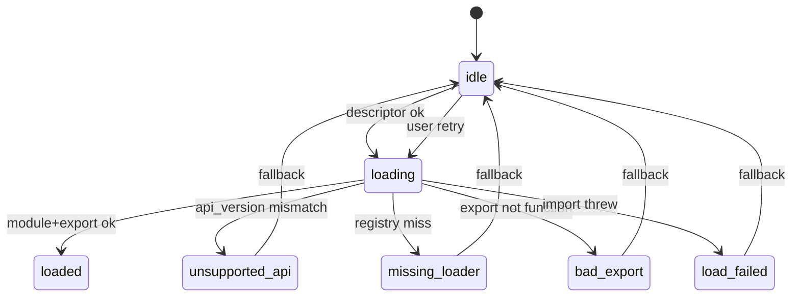

## Why

`OutputContent` 已经支持 frontend bundle renderer，但失败时大多只在 DEV 打 console，用户只看到“突然退回 raw/generic”。这类问题最难的是：它看起来像内容渲染不支持，实际上可能是 bundle 载入失败、export 缺失、api_version 不匹配。

这条提案把 bundle 加载当成一条可观测链路：能看见、能解释、能重试、能上报到诊断。

## What Changes

- 定义 frontend bundle loader 的最小状态机与错误分类：
  - `missing_descriptor` / `missing_loader` / `unsupported_api` / `bad_export` / `load_failed`
- 在 UI 里提供“克制但明确”的 fallback：
  - 生产环境：不打断用户，继续 fallback renderer，但在 Diagnostics 里可见
  - 开发环境：在 output 区域显示一条轻提示（含“复制错误信息”“重试加载”）
- 将加载结果接入现有诊断面：
  - DiagnosticsDialog 增加 “Renderer 状态” 区块：当前 output type 使用 bundle/generic/raw，最近失败原因
- 失败后的重试策略：
  - 手动重试（按钮）
  - 自动重试可选，但需要 cooldown，避免循环请求

## Capabilities

### New Capabilities

- `frontend-bundle-loader-resilience`: loader 状态机、错误分类与诊断挂载点。

### Modified Capabilities

- `plugin-registry-health-and-compatibility-diagnostics`: diagnostics 输出需要补充 bundle 维度。（`c545`）
- `output-renderer-unification-and-plugin-bundle-splitting`: bundle 描述符与兼容信息需要更明确。（`c435`）
- `frontend-error-ux-and-recovery-actions-unification`: fallback 提示与恢复动作遵循统一分层。（`c2020`）

## Impact

- Frontend：排障更快，bundle 迭代成本更低。
- UX：用户少遇到“怎么突然变成 JSON 了”的瞬间。

## Dependency Sketch

