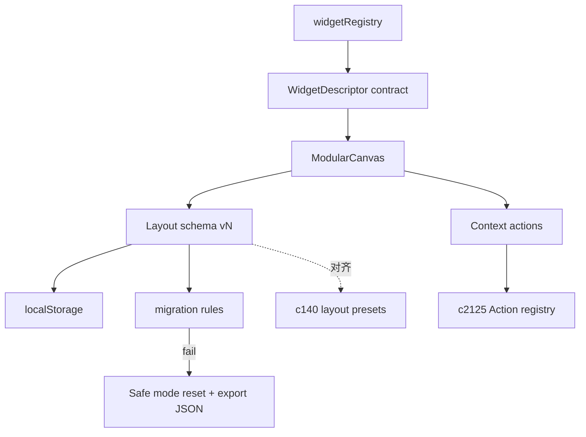

## Why

ModularCanvas 已经在前端出现了：WidgetCatalog、WidgetShell、widgetRegistry 都在。现在缺的不是“再加几个 widget”，而是两条基础约束：

- widget 作为模块，最小契约是什么（尺寸、依赖、是否支持 selection/action）
- 布局如何持久化、如何迁移、坏了怎么恢复

没有这两条，Canvas 会在功能变多后变成“谁都不敢改”的区域。

## What Changes

- 定义 `WidgetDescriptor` 契约（前端 SSOT）：
  - `widget_id`（稳定 key）、`version`、`title`、`icon`
  - `default_size`、`min/max`、`resizable`、`supports_mobile`
  - `data_deps`：依赖哪些 workspace store slice / API（用于预取与诊断）
  - `actions`：可暴露到命令面板（对齐 `c2125`）
- 定义 layout schema + migration：
  - schema version 固化在 payload 里
  - 允许新增字段，但禁止 silent breaking（坏了就进 safe mode）
- 持久化策略分两段走：
  - 第一期：localStorage（让“记住我的现场”成立）
  - 第二期：如果要跨设备同步，再引用 `c140` 提到的 workspace-api-contract 扩展
- Safe mode：
  - 解析失败 / 迁移失败：提供“一键恢复默认布局”，并保留原始布局 JSON 供排障

## Capabilities

### New Capabilities

- `modular-canvas-widget-contract-and-persistence`: widget 描述符、layout schema、迁移与 safe mode。

### Modified Capabilities

- `workspace-layout-presets-and-view-memory`: Canvas 的 layout 是其中一类落点，需要对齐语义。（`c140`）
- `workspace-shared-ui-state`: 布局与焦点对象需要更清晰的可持久化边界。（`c140`）
- `ui-event-idempotency-and-shared-state-merge-contract`: 多处写 layout 时的幂等/合并语义。（`c2012`）

## Impact

- Frontend：后续加 widget 会更快，也更不容易把布局搞崩。
- UX：用户可以真正把 Canvas 当工作台用，而不是“演示功能”。

## Dependency Sketch

