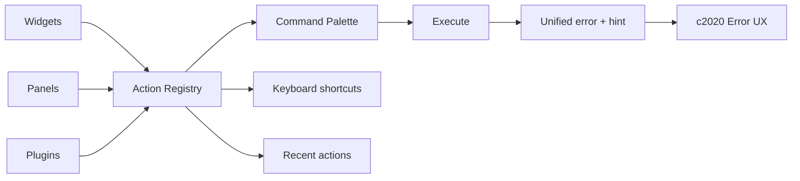

## Why

现在已经有 CommandPalette 的雏形，但动作来源分散：某个面板一个按钮、某个 widget 一个快捷键、某个 plugin 只能靠记忆。短期还能靠“熟练工”，长期一定会出现：

- 动作不可发现（用户不知道系统能做什么）
- 快捷键不可维护（每加一条都怕冲突）
- 测试困难（动作链路无法被稳定触发）

`c44` 提到 Command Palette 的方向，这条提案补上更底层的 action model，让它能变成长期可维护的系统。

## What Changes

- 定义统一 `Action` 契约（前端与后端都能对齐，但先从前端做起）：
  - `action_id`（稳定 key）、`label`、`category`
  - `scope`：global / panel / widget / selection
  - `enabled_when`：依赖 workspace readiness、selection、权限
  - `run()`：执行 handler（返回标准错误对象，走 `c2020`）
  - `shortcut`：可选
- Action Registry：
  - widgets/面板/插件统一注册到 registry
  - CommandPalette 从 registry 构建搜索索引（不再手写列表）
  - 支持 “最近动作” 与 “固定动作”
- Context actions：
  - selection 变化时动态提供动作（例如对某个 source/output 的操作）
  - 和 `c00` 的对象模型/状态词汇对齐：blocked/degraded 时动作要给出可执行 hint

## Capabilities

### New Capabilities

- `command-palette-action-surface`: action model、registry 与 context actions 规则。

### Modified Capabilities

- `workspace-command-palette-and-shortcuts`: 为 `c44` 提供可实现的底层结构。（`c44`）
- `modular-canvas-widget-contract-and-persistence`: widget actions 需要落在统一模型里。（`c2124`）
- `frontend-error-ux-and-recovery-actions-unification`: action 失败/重试交互要收口。（`c2020`）

## Impact

- Frontend：动作入口更统一，后续扩展成本更低。
- UX：用户更容易“搜到我想做的事”，也更容易学会快捷键。

## Dependency Sketch

