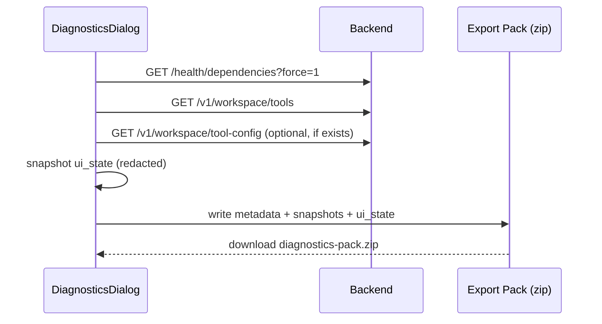

## Why

DiagnosticsDialog 现在能看依赖、看插件加载，但排障经常需要“把现场带走”：给同事、提 issue、对比两次运行的差异。截图不够，翻日志又太重。

`c12` 已经提出 diagnostic bundle 的概念（按 correlation_id 导出）。这条提案做更接地气的一步：从前端一键导出一个默认脱敏的“诊断包”，把关键快照、关键配置摘要、以及 UI 侧信息封装在一起。

## What Changes

- 定义诊断包格式（稳定、可 diff）：
  - `metadata.json`：时间、版本、profile、浏览器信息、correlation_id（若可得）
  - `snapshots/*.json`：`/health/dependencies`、`/v1/workspace/tools`、`/v1/workspace/tool-config`（若有）
  - `ui_state.json`：最小 UI 状态摘要（只包含 ID/开关/布局版本，不带内容大文本）
- 一键导出入口：
  - DiagnosticsDialog 增加 “导出诊断包” 按钮
  - 导出前先运行一次 refresh（可选），让快照尽量新
- 红线：
  - secret 明文禁止进入包（对齐 `c2019`、`c2122`）
  - prompt/source 原文大段内容默认不打包（只留长度/哈希/引用 ID）
- 与后端 diagnostic bundle 对齐：
  - 如果未来接入 `c12` 的 server-side bundle，前端包可以把它作为一个附件文件放进去（先不实现，只约定接口）

## Capabilities

### New Capabilities

- `diagnostics-export-pack`: 导出格式、包含集合、红线与 UI 入口。

### Modified Capabilities

- `observability-bundle-and-traceability`: diagnostic bundle 有了明确 UI 落点。（`c12`）
- `structured-logging-schema-redaction-and-error-sampling`: redaction policy 需要复用。（`c2019`）
- `tool-config-secrets-and-redaction`: 避免把 secrets 打进包里。（`c2122`）

## Impact

- Frontend：排障从“描述问题”变成“给我一个包”，沟通成本会明显下降。
- Backend：不要求先加新接口，但会推动状态/诊断接口更稳定。

## Dependency Sketch

