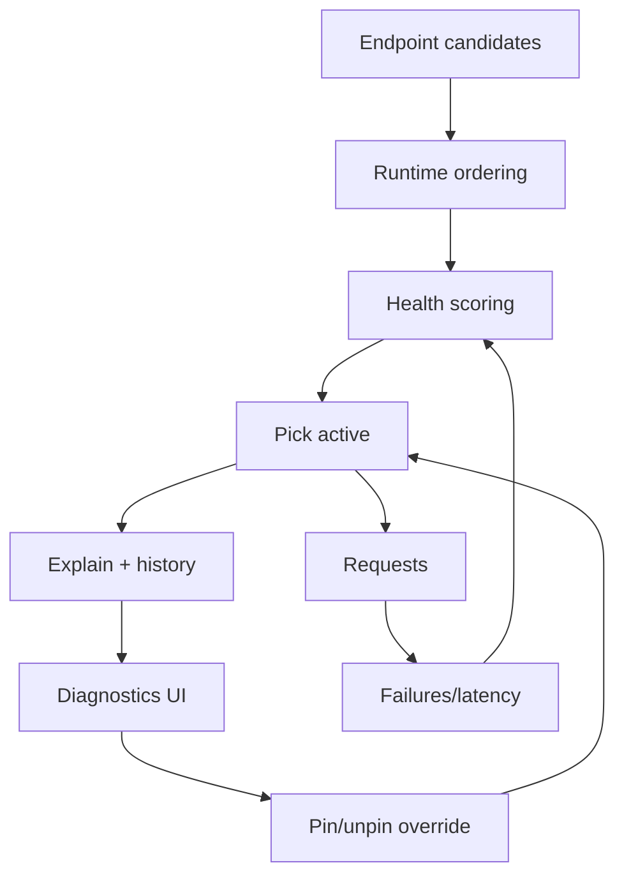

## Why

现在系统里已经大量使用 endpoint candidates：Redis、Chroma、Ollama、SearXNG、以及模型 provider。`c2025` 想把它升级成“健康评分 + 自动切换”。我同意，但如果没有解释面，自动切换会让人很不安：明明没改配置，怎么突然慢了/突然换了一个端点。

这条提案补齐体验闭环：把“我现在用的是哪个端点、为什么选它、我能不能临时固定住”做成稳定接口 + 诊断 UI。

## What Changes

- 暴露可解释的 endpoint 状态接口（按 service_key 聚合）：
  - candidates（含运行环境优先级）
  - active endpoint（当前选中）
  - health 摘要（最近成功/失败、cooldown、粗略延迟分位）
  - explain：结构化原因（例如“上一个端点 5 分钟内 3 次超时，进入冷却”）
- 提供最小 override（用于排障，不做复杂策略）：
  - pin 到某个 endpoint
  - unpin 回到自动
  - “测试当前端点”按钮（probe 一次并回写健康模型）
- 前端落点：
  - DiagnosticsDialog 增加 “Endpoint 路由” 区块（优先覆盖 ollama/search）
  - 每次切换记录一条事件（可复制 correlation_id，配合 `c12/c2019` 排障）

## Capabilities

### New Capabilities

- `model-endpoint-picker-and-health-explainer-ui`: endpoint 解释接口、override 契约与诊断 UI。

### Modified Capabilities

- `model-endpoint-health-scoring-and-failover-routing`: 解释输出与 override 需要建立在健康模型上。（`c2025`）
- `optional-services-readiness-contract`: endpoint status 需要对齐 optional services 的 status/hint。（`c2003`）
- `profile-capability-matrix-and-degraded-mode-explainer`: profile 视角的解释可复用同一份数据。（`c2021`）
- `observability-bundle-and-traceability`: 端点切换应能被诊断包捕获。（`c12`）

## Impact

- Backend：新增 endpoint 状态输出与 override 存储（可以先内存/配置级），并和健康模型共享字段。
- Frontend：诊断页更可解释，遇到“偶发慢/偶发错”能先把变量收敛。
- Generated artifacts：
  - SSOT：后端 OpenAPI
  - drift gate：沿用 `c2011` 的 `just api-check`
  - 前端同步：`pnpm run api:sync`

## Dependency Sketch

