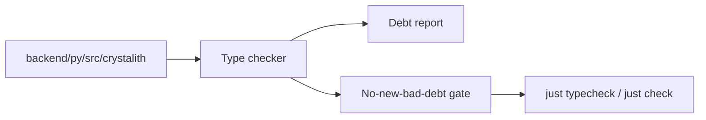

## Why

backend 已经开始用较多的 pydantic + typing，但代码一长，类型质量最容易“悄悄变差”：某个地方为了赶进度加了 Any，另一个地方为了绕过错误改成 dict，半年后就没人敢动。

这条提案的目标不是“一夜之间全仓库 0 类型错误”，而是先把底线钉住：不允许新增坏债，慢慢把核心层变得可靠。

## What Changes

- 选定单一 type checker（推荐 pyright；不做 mypy/pyright 双轨）
- 分区门禁（由严到松）：
  - Tier 0：`crystalith/shared/`、`crystalith/web/`（契约层，先收紧）
  - Tier 1：`crystalith/features/*`（逐步收紧）
- 规则：
  - 新增/修改的文件必须通过 type check（“旧债不追，但不许新增”）
  - 禁止在 Tier 0 引入 `getattr/hasattr/__getattr__` 这类动态属性访问
  - `Any` 只能在边界层出现，并且要有明确理由（先靠报告统计）
- 命令入口（proposal 级约定）：
  - `cd backend/py && just typecheck`（或等价入口）
  - 将其纳入 `just check`（先本地，后 CI）

## Capabilities

### New Capabilities

- `backend-type-safety-and-static-analysis-gates`: 类型检查与静态分析门禁。

### Modified Capabilities

- `backend-feature-module-conventions-and-scaffolding`: 新模块模板要默认满足门禁。（`c2018`）
- `backend-feature-module-migration-sweep-and-consistency-gates`: sweep 时可以顺手把 Tier 0 的债收口。（`c2100`）

## Impact

- Backend：核心层更稳，后续 refactor 成本更低。
- Risk：门禁太严格会拖慢推进；所以从“禁止新增坏债”起步，而不是全量清零。

## Dependency Sketch

