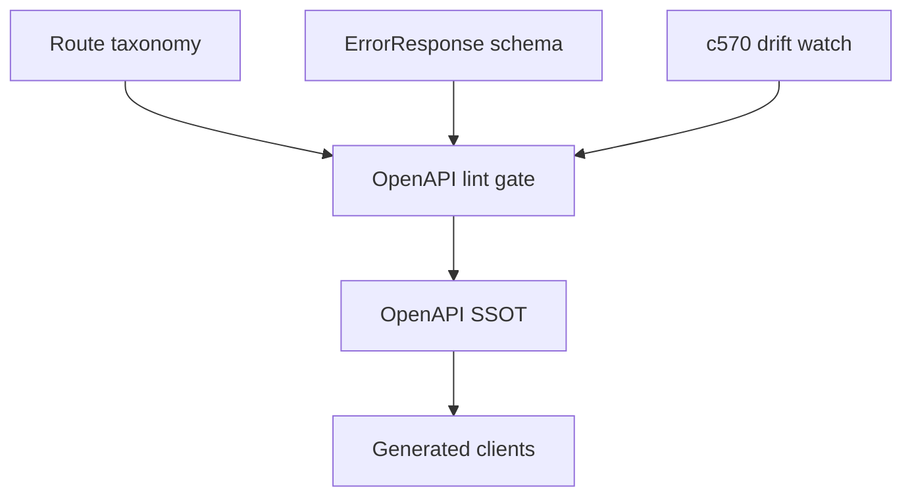

## Why

features 越多，OpenAPI 越像“把所有东西堆在一起”。短期还能靠熟悉代码的人找接口，长期会出现三种漂移：

- 同一类接口 tag/命名不一致，前端 generated client 很难分层组织
- 新接口忘记挂统一错误响应，UI 又回到字符串判断
- 文档里看不出哪些是“诊断/内部接口”，哪些是主链路能力

`c2011` 解决的是错误契约，这条提案解决的是“接口表面”的秩序。

## What Changes

- 定义一份 route taxonomy（文档契约）：
  - tags：固定集合与命名（notebooks/sessions/messages/sources/outputs/workspace/diagnostics…）
  - path：统一版本与前缀（主链路保持 `/v1/...`，诊断类单独分组）
  - operationId：命名规则（避免生成代码里出现随机/冲突）
- 做一个最小 gate（lint）：
  - 每个 router 必须有 tags
  - 新增 endpoint 必须声明非 2xx 响应，并引用 `ErrorResponse`（对齐 `c2011`）
  - 允许逐步修旧债，但禁止新增“散装 detail”
- **BREAKING** 约束（仅当需要重排 path 时）：
  - 如果要改 path/tag 的稳定 key，必须在 proposal 里列出 old -> new，并同步更新前端生成 client
  - 默认优先不动 path，只先做 tags/operationId/错误覆盖率门禁

## Capabilities

### New Capabilities

- `openapi-surface-cleanup-and-route-taxonomy`: taxonomy 约定 + 最小 lint gate。

### Modified Capabilities

- `openapi-error-contract-and-doc-gates`: taxonomy gate 作为 doc gate 的补充。（`c2011`）
- `api-shape-consolidation-and-generated-client-slimming`: 路由结构会直接影响生成产物组织。（`c130`）
- `openapi-client-contract-drift-watch`: drift watch 需要把 taxonomy 变化标为高风险。（`c570`）

## Impact

- Backend：接口增长不再靠“自觉”，而是有门禁可依。
- Frontend：generated client 的结构更稳定，错误处理更统一。
- Generated artifacts：
  - SSOT：后端 OpenAPI
  - 生成入口：沿用 `c2011` 的 `just api-export`
  - drift gate：沿用 `c2011` 的 `just api-check`
  - 前端同步：`pnpm run api:sync`

## Dependency Sketch

