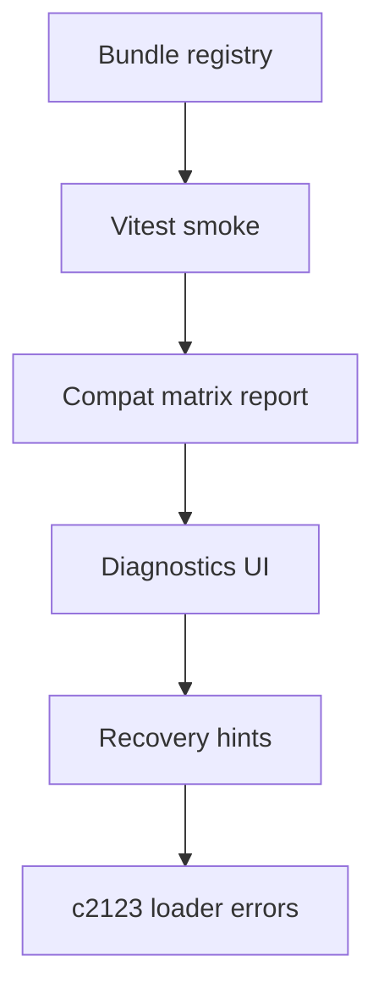

## Why

现在 output 的 frontend bundle 已经在跑，但缺少“可验证的底线”。一旦某个 bundle 的 export 变了、api_version 漂了、或者 registry 漏了 loader，问题往往要到运行时才暴露，而且很难定位。

`c29/c545` 已经在做 plugin 侧的健康诊断，这条提案把 frontend bundle 拉进同一张兼容矩阵，并且加上最小 smoke tests，让回归尽量早发生、尽量好解释。

## What Changes

- 定义 bundle compat matrix（作为诊断与门禁的共同数据）：
  - bundle_id、api_version、export 名、对应 output_type
  - 支持的最小 payload 约束（只要能 render 一份最小内容即可）
- 增加前端侧 smoke tests（Vitest）：
  - 遍历 builtin bundle registry
  - 动态加载模块并验证 export 是函数
  - 对每个 bundle 跑一个最小 render（不追求截图，只验证不抛错）
- 将结果接入 diagnostics：
  - DiagnosticsDialog 显示 “bundle 健康摘要”
  - 失败时给出下一步动作（对齐 `c2123` 的错误分类）

## Capabilities

### New Capabilities

- `plugin-frontend-bundle-compat-matrix-and-smoke`: bundle 兼容矩阵与 smoke tests 约定。

### Modified Capabilities

- `plugin-health-smoke-tests-and-compat-matrix`: 兼容矩阵扩展到 frontend bundle。（`c29`）
- `plugin-registry-health-and-compatibility-diagnostics`: diagnostics 输出需要包含 bundle 维度。（`c545`）
- `frontend-bundle-loader-resilience`: 错误分类与 UI 复用。（`c2123`）

## Impact

- Frontend：bundle 回归更早被发现，修复成本更低。
- DevEx：把“靠经验”变成“靠测试与报告”。

## Dependency Sketch

