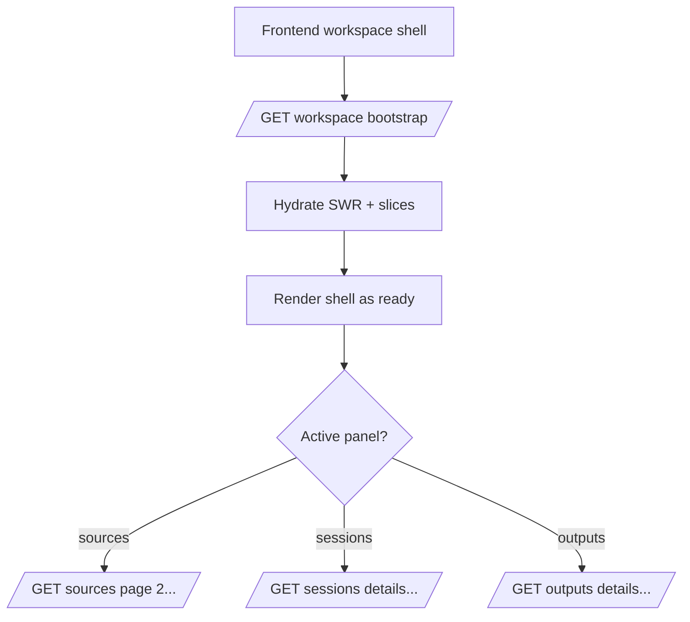

## Why

现在进入 Workspace 的“第一口气”有点散：顶层壳、各个 panel、SWR、Zustand slice、SSE 连接都会各自发请求、各自等结果。网络一抖，体验就会变成多处 spinner 和局部空白；更麻烦的是排查——到底是哪个请求慢、哪个状态没对齐，很难一眼看懂。

我们已经在 `c00` 把对象模型/readiness 往统一收，也有 `c120` 的状态投影/summary cache 雏形。下一步应该把“首屏所需的最小信息”收成一个稳定入口，让前端能一次拿到可用的启动快照，然后再渐进加载细节。

## What Changes

- 增加 workspace bootstrap endpoint（只覆盖首屏关键数据）：
  - notebook/workspace 的摘要（readiness、推荐动作、关键计数）
  - 当前 profile/能力摘要（可选服务/插件诊断的最小信号）
  - 关键面板的首屏数据“种子”（例如 sources/sessions/outputs 的第一页或其摘要）
- 定义 hydration 规则：
  - 前端拿到 bootstrap 后，直接 hydrate 到 SWR cache 与 workspace state slices（对齐 `c2006`、`c2104`）。
  - 随后按“用户当前打开的 panel”再触发更细的请求，避免一上来全量拉满。
- 明确边界：
  - bootstrap 不承诺覆盖所有面板的全量数据；它只负责让壳层“活过来”，并把后续加载变得可预测。
  - 错误必须走统一 error contract（对齐 `c2011`、`c2102`），否则 bootstrap 反而会变成新的黑箱。

## Capabilities

### New Capabilities

- `workspace-bootstrap-endpoint-and-hydration`: bootstrap 响应形状、首屏种子范围与 hydration 规则。

### Modified Capabilities

- `workspace-api-contract`: 增加 bootstrap 路由与返回语义，并与分页/field sets（`c2017`）保持一致。
- `workspace-ui-core`: 壳层 ready 的判定与渐进加载策略需要收口。
- `workspace-object-model-and-readiness`（`c00`）：bootstrap 必须复用统一 readiness 词汇。
- `workspace-state-projection-and-summary-cache`（`c120`）：建议作为 bootstrap 的主要数据来源之一，避免 N+1 拼装。
- `frontend-swr-key-registry-and-invalidation`（`c2006`）：定义“bootstrap hydrate”对应的 cache keys 与失效规则。

## Impact

- Frontend：首屏从“多处等待”变成“先活再细化”，也更容易做性能度量（对齐 `c2013`）。
- Backend：需要一个聚合器，但聚合器要克制，宁愿少给点，也别把每个面板都塞进来。

