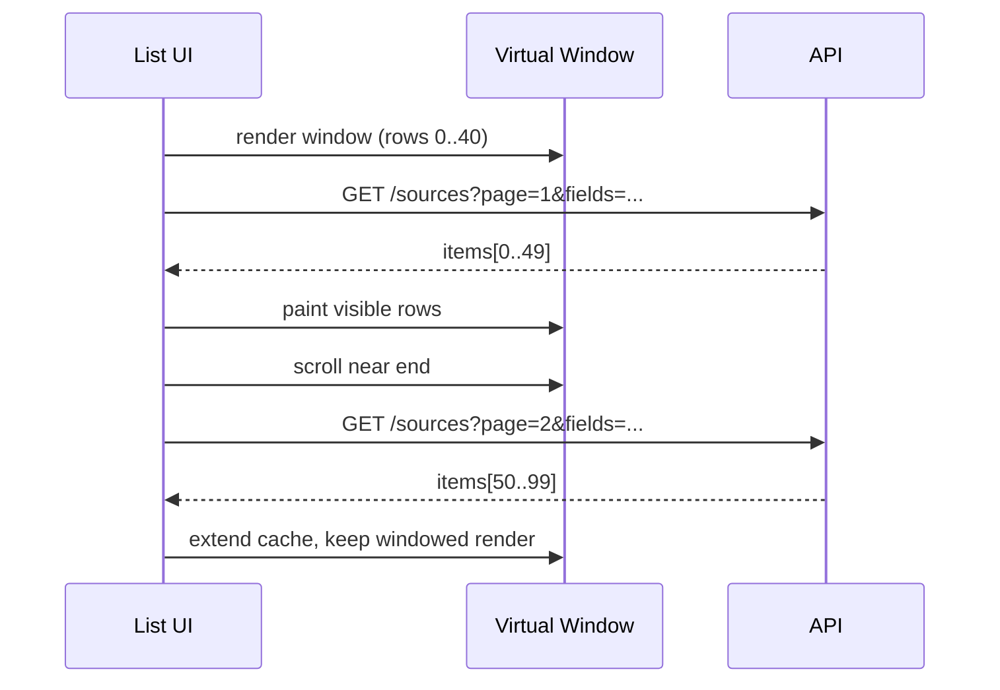

## Why

Workspace 的列表会自然变大：sources 越导越多，sessions/outputs 越跑越多。列表一旦过千，前端就会开始“钝”：滚动掉帧、选择卡顿、甚至只是展开一个详情都会慢。更糟糕的是，这种慢不是 bug，大家往往会忍着，直到某天突然“完全不能忍”。

这份 change 想把一个朴素原则写进契约：**大列表必须 windowed 渲染**。不然我们后面做 capacity/预算（`c36`）和性能 gate（`c2013`、`c38`）都会变成空话。

## What Changes

- 定义 workspace 列表的 virtualization 规范：
  - sources/sessions/outputs/templates 等高增长列表默认启用 windowed rendering。
  - 列表项必须用稳定 key（对象 id），并避免把整对象一路透传到 row（减少无意义 re-render，对齐 `c2130`）。
- 定义“分页 + 虚拟列表”的组合方式：
  - API 分页与 field sets 由 `c2017` 提供；前端用 virtualization 解决渲染成本。
  - 滚动接近底部时按需拉下一页，避免一次性加载过多。
- 增加可见的降级策略：
  - 如果某些列表项高度不可预测（例如富文本预览），v1 允许切换为“分段分页 + 预览弹层”，先保证流畅。

## Capabilities

### New Capabilities

- `frontend-list-virtualization-and-windowed-rendering`: 列表虚拟化适用范围、行渲染约束与降级策略。

### Modified Capabilities

- `workspace-ui-panels`: 各面板列表实现要对齐虚拟化规范。
- `api-list-contracts-pagination-filtering-and-field-sets`（`c2017`）：分页与字段裁剪是虚拟列表的前置。
- `frontend-state-performance-budget-and-selector-guidelines`（`c2130`）：把“列表 row 只能订阅必要字段”写成可执行准则。
- `web-performance-budgets`（`c38`）：把“列表滚动掉帧/INP 退化”纳入预算观察点。

## Impact

- UX：大 notebook 不再越用越卡；性能提升会很直接。
- Engineering：形成统一的列表实现套路，避免每个面板各写各的坑。

