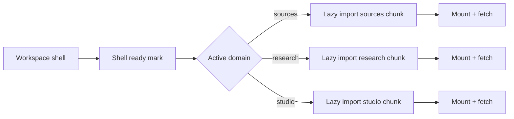

## Why

现在 workspace 越来越像一个“多域应用”：sources、research、studio、templates、analysis……每个域都有自己的状态、数据请求和渲染成本。如果我们在进入 workspace 时就把所有域都 mount 完，首屏会越来越慢；如果每个域又各自开 SSE、各自订阅状态，就会越来越费电、越来越难排查。

这份 change 的目标很明确：**壳层先快起来，面板按需变重**。让性能问题从“不可控的整体变慢”变成“可解释的加载阶段”。

## What Changes

- 定义面板生命周期约定：
  - active panel 才允许 mount 重组件与启动重请求
  - inactive panel 允许保持轻量占位（或保留状态但不做刷新）
- 引入 route-level code splitting（以 workspace domains 为粒度）：
  - 让 bundle 体积与加载成本更可控，并能被 `c38/c2013` 的报告归因。
  - 允许在用户 hover/快捷键导航时做预加载，但默认保持克制。
- 收口连接与订阅：
  - SSE 连接、全局诊断与关键状态订阅必须在壳层集中（对齐 `c2026`），避免面板各开一套。

## Capabilities

### New Capabilities

- `workspace-panel-lazy-mount-and-route-code-splitting`: 面板生命周期、lazy mount 规则与代码拆分边界。

### Modified Capabilities

- `workspace-ui-core`: 壳层装配方式需要支持“先壳后域”的加载顺序。
- `workspace-ui-panels`: 面板需要适配生命周期（mount/unmount/standby）的边界。
- `frontend-sse-connection-multiplexing-and-resource-guards`（`c2026`）：避免重复连接与重复订阅。
- `frontend-performance-marks-and-web-vitals-gates`（`c2013`）：把“workspace 壳 ready”“域首屏 ready”作为 mark 分开度量。

## Impact

- Frontend：需要动装配层，但长期收益很大——后续加新面板不再天然拖慢首屏。
- DX：性能回归更容易定位到“哪个域的 chunk”“哪个面板的 mount”。

