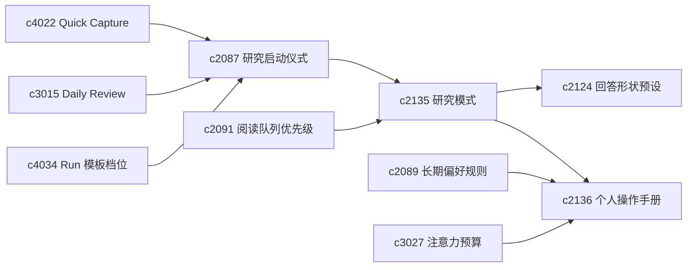

## Why

同一人做研究时，常在**摸底、核证、综合**等心智模式间切换；若系统始终用同一工作面承接，提示易不合时宜。需要 **research mode**（explore / verify / synthesize）驱动阅读排序、提示强度、run 默认值与输出落点，且模式切换对用户可见。但每次开始前重复纠结“先收哪些来源、先跑哪类检索、先不要碰什么”会耗散精力；需要**研究启动预设与起步检查单**，把晨间回看、新主题摸底、补证、成稿前复核等沉淀为一键开场，并与队列、保存检索、run 模板串联。长期使用后，系统还能观察到**习惯与节奏**；把这些收成友好的**个人操作手册**与定期 **workstyle reflection**，回接注意力预算、研究模式与长期规则，避免变成绩效式约束。

**主题：Personal research workflow: modes, rituals & workstyle**

> 合并说明：本提案合并了原 `research-ritual-presets-and-startup-checklists`、`personal-operating-manual-and-workstyle-reflection`、`attention-budget-plans-and-deep-work-windows` 的全部内容。

## What Changes

1. **研究模式**：定义 research mode 三档；不同模式影响阅读排序、提示强度、run 默认值与输出落点；模式数量克制，不做复杂流程编排器。
2. **启动预设与检查单**：定义 research ritual preset；增加 startup checklist（进入 run 或编辑前的明确起步步骤）；与 queue、saved search、run template 串成一键开场；检查单可自动生成也可由用户精简。
3. **个人操作手册与节奏反思**：定义 personal operating manual；增加 workstyle reflection；回接 attention budget、research mode 与 durable rule；语气偏建议，非强制性绩效面板。
4. **注意力预算与深度工作窗口**：定义 attention budget plan，把主题、线程和日常维护按注意力强度分类；增加 deep work window，让系统在某些时段收起非必要提示和低优先动作；与 focus mode、idle execution、review bucket 联动；保持为辅助节奏工具，不变成番茄钟类管理系统。

## Capabilities

### New Capabilities

- `research-modes-explore-verify-synthesize`：研究阶段模式与模式驱动默认行为。
- `research-ritual-presets-and-startup-checklists`：个人研究启动预设、检查单与开场动作编排。
- `personal-operating-manual-and-workstyle-reflection`：个人工作说明与节奏反思面。
- `attention-budget-plans-and-deep-work-windows`：注意力预算和深度工作窗口。

### Modified Capabilities

- `quick-capture-inbox-and-triage-flow`：inbox 清理可接入启动检查单。
- `daily-review-resurfacing-and-deferred-items`：支持“今天先做哪种 ritual”等入口。
- `run-template-profiles-and-resume-defaults`：可被 ritual preset 引用。
- `reading-queue-prioritization-and-guided-order`：阅读顺序受当前模式影响；与 `source-reading-modes-and-density-controls`（已并入 `c2091` 提案）协同时，队列可建议阅读模式。
- `answer-shape-presets-and-output-landing-zones`：不同模式有不同结果落点偏好。
- `steering-preferences-and-durable-user-rules`：长期规则可上升到工作方式说明。
- `workspace-focus-mode-and-distraction-pruning`：专注模式需要能读取注意力计划。
- `background-refresh-windows-and-idle-execution`：空闲执行需要避开深度工作窗口。
- `personal-work-queues-and-review-buckets`：队列需要按注意力预算排序。

## Impact

- **Backend**：模式状态、默认策略、建议生成；预设存储、检查单生成与动作装配；行为摘要、长期偏好整理与反思提示生成；个人手册可消费模式使用统计（在同一套模式能力规范内扩展字段/聚合，不单列为重复 capability）。
- **Frontend**：首页切换、运行配置与工作面文案；启动弹层与队列引导；设置页、回顾页与模式建议解释。
- **Dependencies**：模式线承接 `c2087`、`c2091`、`c2124`；仪式线与 `c4022`、`c3015`、`c4034` 同链；手册线承接 `c2089`、`c3027`、`c2135`。

## Dependency Sketch

