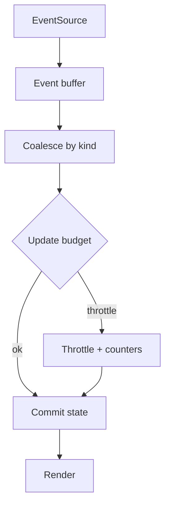

## Why

SSE 一旦进入主交互通道，最容易出现一种“看起来都对，但就是卡”的问题：事件本身没错，UI 也在更新，但更新太频繁了。token 流、progress 事件、shared_state patch 叠在一起，React 会被迫高频重渲染，最后掉帧、INP 变差、风扇起飞。

我们已经有事件信封契约（`c09`/`c2007`）和连接复用/资源保护（`c2026`）。这份提案补的是客户端侧的“节流和合并”，让 UI 更新变得可控、可解释。

## What Changes

- 定义 SSE 事件的 coalescing 规则（按 kind 分桶）：
  - `token.delta`：允许在 50~100ms 窗口内合并成一次 UI 更新（内容不丢，只是合并刷新次数）。
  - `task.progress`：同一 task 只保留最新一条 progress（旧的直接覆盖）。
  - `shared_state.patch`：按批应用，避免 patch 风暴把主线程打满。
- 定义 UI update budget：
  - 每秒最大 state commit 次数（超过则进入节流模式，并对用户提示“已降频以保持流畅”）。
  - 记录 dropped/coalesced 计数，进 diagnostics（对齐 `c30`、`c2013`）。
- 语义红线：
  - 合并/节流不得改变最终一致性：最终渲染状态必须与 event_id 序列一致（对齐 `c2012` 的幂等/合并契约）。

## Capabilities

### New Capabilities

- `sse-event-coalescing-and-ui-update-throttling`: 事件合并规则、预算阈值与诊断输出。

### Modified Capabilities

- `sse-event-schema-and-stream-client`（`c2007`）：新增客户端侧统计字段与调试开关（不改变服务端契约）。
- `ui-event-idempotency-and-shared-state-merge-contract`（`c2012`）：明确 patch 合并与最终一致性要求。
- `frontend-performance-marks-and-web-vitals-gates`（`c2013`）：把“事件风暴导致 INP 退化”变成可捕捉信号。
- `frontend-sse-connection-multiplexing-and-resource-guards`（`c2026`）：coalescing 需要与连接复用一起工作，避免双重缓冲。

## Impact

- UX：同样的 run，在普通电脑上也更稳、更省电。
- Engineering：把“卡顿”从玄学变成指标：事件吞吐、合并率、commit 频率都能看见。

