## Why

“慢”本身不可怕，可怕的是不知道慢在哪里。现在我们有 task phases（`c2106`）可以告诉用户“正在做什么”，但还缺一个更直观的东西：这次 run 的时间到底花在排队、检索、生成、后处理还是限流等待上？如果能一眼看出瓶颈，很多优化就不需要靠猜。

这份 change 把“时间分解”做成 run 的一等信息，并给前端一个轻量 timeline 视图，既服务用户预期，也服务性能排查。

## What Changes

- 定义 run timings 的最小字段集（阶段级）：
  - phase start/end/duration（复用 `c2106` 的 phase 命名，必要时允许 run 级别聚合）
  - queue_wait / rate_limit_wait 这类“不是我在算，但我在等”的时间也要显式记录
  - `correlation_id` 贯穿（对齐 `c2002`）
- 服务端输出路径：
  - run 结束后返回 timings 摘要（run detail API）
  - 可选：在 SSE 最后一个事件里附带 timings（对齐 `c09` 的 envelope 可选 timings 字段）
- 前端新增 perf timeline view：
  - 一条横向时间轴，显示阶段条与关键 note
  - 点击阶段可跳到 diagnostics（如果启用 `c30`），或至少复制 correlation_id

## Capabilities

### New Capabilities

- `run-timings-breakdown-and-perf-timeline-view`: timings 字段、输出时机与 UI 时间轴最小交互。

### Modified Capabilities

- `task-phase-breakdown-and-progress-events`（`c2106`）：phase 需要能挂载时间戳与最终汇总。
- `observability-bundle-and-traceability`（`c12`）：timings 的命名与 trace/span 需要能对齐（哪怕 v1 只是弱关联）。
- `request-context-and-correlation-ids`（`c2002`）：保证 timings 能串到一次完整动作。
- `run-cost-time-estimates-and-interrupt-points`（`c380`）：预估 vs 实际耗时可以在同一视图对照（先展示，不做复杂分析）。

## Impact

- UX：用户更敢等，也更敢停；慢的时候知道该怪谁（外部依赖、限流、还是自己数据太大）。
- Engineering：优化会更聚焦，不再盲人摸象。

```mermaid
gantt
  title Run timings (example)
  dateFormat  X
  axisFormat  %s
  section run
  queued / rate limit wait :a1, 0, 3
  retrieval               :a2, 3, 2
  generate                :a3, 5, 6
  postprocess             :a4, 11, 2
```

