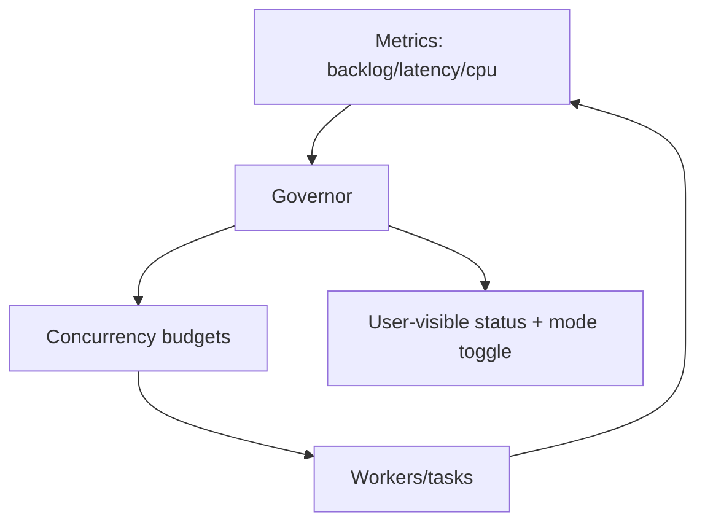

## Why

同一个 Crystalith，在不同 profile 下“体感”差异会很大：local 跑在笔记本上，hybrid 有一些 docker 依赖，full 则可能把更多东西都打开。现在我们有并发预算与背压可视化（`c39`），但如果预算是静态写死的，仍会出现两种极端：

- 在小机器上跑得太猛：CPU 满载、UI 卡顿、风扇狂转
- 在大机器上跑得太保守：明明资源够，任务却慢吞吞

个人产品更需要一个“懂得收手”的调度器：默认不折腾，但在负载变化时能自动调节。

## What Changes

- 定义 profile-aware 的默认资源档位：
  - 按 profile（local/hybrid/docker/full）给出 embedding/indexing/retrieval/generate 的默认并发预算
  - 可选：根据机器能力（CPU/内存）对预算做一次软调整（不追求精确，先避免离谱）
- 引入 adaptive concurrency governor（v1 极简）：
  - 观测 backlog、平均耗时、限流等待与 CPU 压力
  - 在上下界内动态调节并发（例如检索变慢时先降并发，避免把外部依赖打挂）
- 把“正在被限流/正在降档”的信息露出来：
  - 通过 task phase note（`c2106`）或 backpressure UI（`c39`）提示用户
  - 让用户能一键切换到“安静模式/加速模式”（默认只提供两个档位）

## Capabilities

### New Capabilities

- `profile-aware-resource-tuning-and-adaptive-concurrency`: 资源档位、governor 规则与可见信号。

### Modified Capabilities

- `config-profile-overlays-and-drift-guards`（`c14`）：资源档位需要落到配置层，并可被 overlay 覆盖。
- `concurrency-budgets-and-backpressure-visibility`（`c39`）：背压信号要能被 governor 消费与解释。
- `background-jobs-and-task-runtime`: 任务调度需要支持动态并发调整（不要求换框架，先定契约）。
- `task-phase-breakdown-and-progress-events`（`c2106`）：把“在等配额/在降档”的状态说清楚。

## Impact

- UX：更少“电脑被跑满”的挫败感；也更少“为什么这么慢”的疑惑。
- Engineering：并发与性能不再靠调参玄学，能逐步收敛成稳定默认值。

