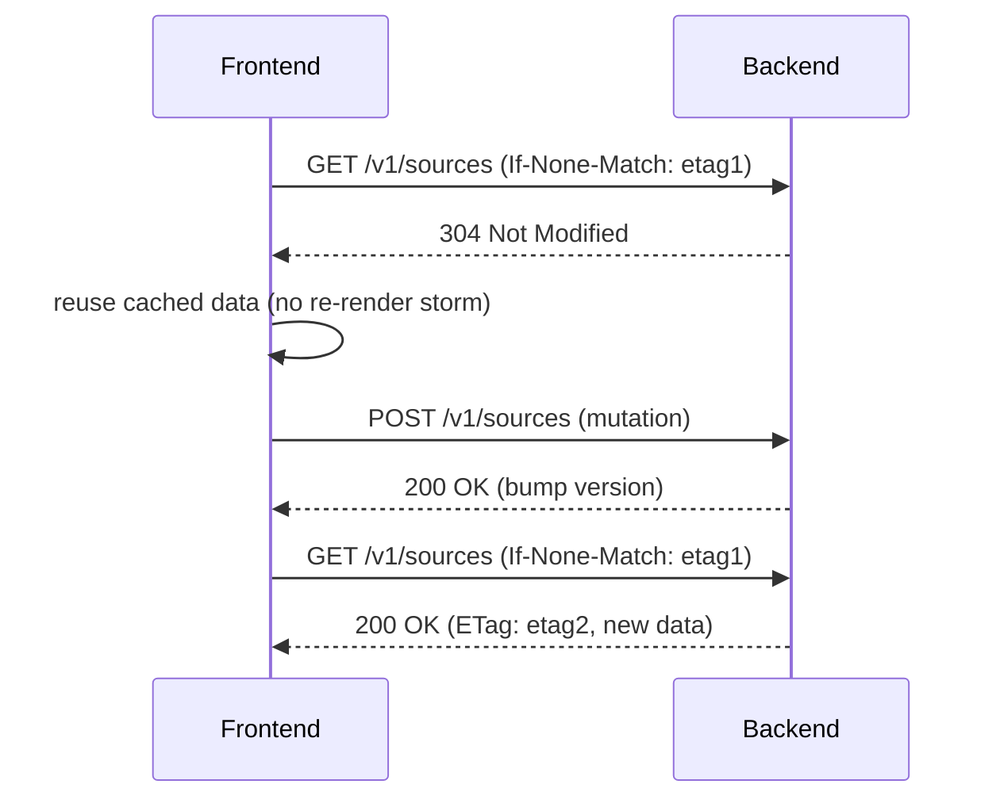

## Why

Workspace 里有不少接口是“读多写少”：列表、摘要、工具/插件诊断、配置视图。现在这些接口在刷新、切换面板、SWR revalidate 时会被反复请求。对用户来说就是：明明什么都没变，却还要再等一次；对后端来说就是：做了很多重复工作。

HTTP 缓存（ETag / If-None-Match / Cache-Control）在这里是很划算的杠杆：它不改变业务语义，却能直接减少耗时和带宽。

## What Changes

- 为选定的 read-heavy endpoints 定义缓存契约：
  - 何时可以返回 304（representation 未变）
  - ETag 的生成基准（例如 `updated_at` 聚合、版本号或 cache epoch）
  - Cache-Control 的默认策略（短 TTL + revalidate，而不是长时间强缓存）
- 客户端缓存键收口：
  - 由 API client wrapper 统一注入 If-None-Match（对齐 `c2103`、`c2104`）
  - SWR 层把 304 视为“数据未变”，避免触发无意义的 re-render（对齐 `c2006`）
- 明确失效策略：
  - mutation 后如何让相关 ETag 变化（资源版本 bump / cache epoch 变更）
  - 不追求一次覆盖全站，v1 只覆盖最热的 5~10 个接口

## Capabilities

### New Capabilities

- `http-response-caching-etag-and-client-cache-keys`: ETag/304 语义、客户端注入与失效规则。

### Modified Capabilities

- `frontend-api-client-wrapper-and-typed-errors`（`c2103`）：统一处理 304/缓存命中统计。
- `frontend-data-fetching-standardization-and-swr-adoption`（`c2104`）：revalidate 策略需要与缓存语义咬合。
- `frontend-swr-key-registry-and-invalidation`（`c2006`）：缓存键与失效范围必须可追踪。
- `cache-epoch-inspection-and-invalidation-preview`（`c585`）：可选，把 cache epoch 变成显式的失效工具。

## Impact

- Frontend：切换面板/刷新更快，且更不容易被网络抖动影响。
- Backend：减少重复序列化与重复查询，整体更稳。

