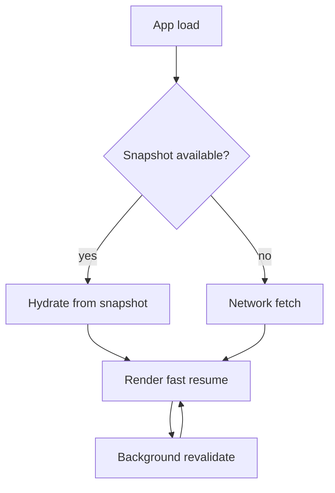

## Why

个人用户的使用节奏很碎：开一下、关一下、刷新一下。每次回到 workspace 都从零开始拉数据，会让“回到工作现场”的成本越来越高。更现实的是：在本地/弱网环境里，这种重复拉取还会被网络波动放大，体验一下就掉。

我们已经有 summary cache（`c120`）和 SWR key 词典（`c2006`）的方向。这份提案把它们往前推一步：允许前端把一小部分“安全且高复用”的 cache 做成快照，刷新后先用快照把 UI 撑起来，再后台 revalidate。

## What Changes

- 定义可持久化 cache 的白名单（v1 很小）：
  - notebook/workspace 摘要、列表第一页、工具/插件诊断摘要、UI 偏好与布局版本
  - 明确禁止：secrets、原文大段内容、消息正文全量
- 定义快照版本与失效规则：
  - 绑定到 app build id / schema version
  - 不匹配就直接丢弃（宁愿慢一次，也别用错数据）
- UI 行为约定：
  - fast resume：先渲染快照，再显示“已恢复，正在刷新”的轻提示
  - revalidate 完成后平滑更新，不触发整页抖动
- 增加“清理本地快照”的入口：
  - 放在 diagnostics（`c30`/`c2126`）或设置里，避免用户被坏缓存困住

## Capabilities

### New Capabilities

- `frontend-cache-snapshot-and-fast-resume`: 快照白名单、版本策略与恢复 UI 行为。

### Modified Capabilities

- `workspace-state-projection-and-summary-cache`（`c120`）：快照优先消费投影数据，避免把临时数据结构持久化。
- `frontend-swr-key-registry-and-invalidation`（`c2006`）：明确哪些 keys 可以被 snapshot、如何失效。
- `frontend-data-fetching-standardization-and-swr-adoption`（`c2104`）：revalidate 策略需要配合 fast resume。
- `storage-and-cache-maintenance-tooling`（`c18`）：可选，把“清缓存”作为维护动作的一部分。

## Impact

- UX：刷新/重启更像“回来继续干”，而不是“重新进入一个 app”。
- Risk：快照一旦范围过大就容易出问题；v1 必须克制，只做小白名单。

