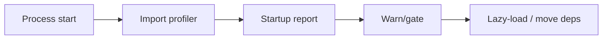

## Why

个人开发时，后端的“启动速度”和“热重载速度”会直接影响推进效率。随着 features、插件、可选服务增多，最常见的退化不是请求慢，而是：`uvicorn` 每次 reload 都要等很久，甚至只改了一个小文件也要吞下一堆 import 成本。

我们已经在 `architecture-plugin-and-agent`/`official-plugins` 里写了“禁用插件不 import”“core-only 不拉重依赖”的原则，但如果没有测量和门禁，这些原则很容易被不小心破坏。

## What Changes

- 增加 backend startup/import cost audit（默认 dev/local 开启）：
  - 输出每个模块/包的 import 耗时 top list
  - 标注“可能的重依赖来源”（例如浏览器渲染、PDF 解析等）
- 定义 lazy-loading 约定（不搞花活，先落最有效的）：
  - 禁用插件必须零 import 副作用（对齐 `architecture-plugin-and-agent` 的 enable policy）
  - 重依赖能力必须延迟到“真正调用时”再 import/init
- 引入轻量门禁：
  - core-only 启动耗时预算（先 warn，再 gate）
  - 把报告入口接到 diagnostics 或 just 命令，方便每次改动后自检

## Capabilities

### New Capabilities

- `backend-startup-import-cost-audit-and-lazy-loading`: import profiling 输出、lazy-load 约定与预算门禁。

### Modified Capabilities

- `architecture-plugin-and-agent`: 补齐“禁用插件不 import”的可执行自检方式。
- `official-plugins`: 官方插件的依赖边界需要能被 audit 证明（core 不应被拖慢）。
- `quality-and-regression`: 把启动预算作为低噪音 guardrail（先非阻断）。

## Impact

- DX：reload 变快，迭代更顺。
- Engineering：能更早发现“我不小心把重依赖 import 到 core 里了”这种隐性回归。

