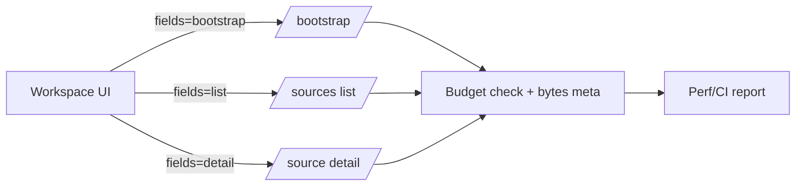

## Why

性能问题里最“闷声杀人”的一类，是响应体越来越胖：列表接口默认带上太多字段，前端每次切换面板/刷新都在搬运无用信息。结果就是：

- 首屏变慢（不仅慢在 DB，慢在序列化和网络）
- SWR revalidate 变成流量风暴（对齐 `c2104`）
- ETag/304 的收益被稀释（你省下 304，却还是要先拉一大坨才能算 ETag）
- 任何“首屏 bootstrap/hydration”的努力都会被响应体反噬（对齐 `c2132`）

我们已经在 `c2017` 定义了 list contract + field sets，但没有把“字段集合”当成性能契约的一部分来管理。这个 change 的目标是：**让响应体大小可预算、可回归、可解释**。

## What Changes

- 为 read-heavy endpoints 定义 response size budgets（先覆盖最热的 5~10 个）：
  - `list` / `detail` / `bootstrap` 等 fieldset 下的目标上限（bytes）
  - 超出时的行为：dev/CI 先 warn，成熟后再 gate
- 引入 fieldset presets（在 `c2017` 的基础上更具体）：
  - 约定 `fields=bootstrap|list|detail`（或等价枚举），避免每个页面自己拼 include
  - OpenAPI 明确这些 presets 的含义与字段集合边界
- 在响应里补一个轻量的可见信号：
  - `meta.bytes`（或 response header）给出本次序列化后字节数，便于前端/诊断包直接展示
- 把 budgets 和 `c2013/c38` 的性能报告打通：
  - bundle 变大能看见
  - 响应体变大也能看见

## Capabilities

### New Capabilities

- `api-response-size-budgets-and-fieldset-presets`: response size budgets、fieldset presets 与回归 gate 约定。

### Modified Capabilities

- `api-list-contracts-pagination-filtering-and-field-sets`（`c2017`）：从“能用”推进到“可预算”。
- `workspace-api-contract`: 列表/摘要/详情接口需要落地 presets，并产出 bytes 信号。
- `workspace-bootstrap-endpoint-and-hydration`（`c2132`）：bootstrap 的 fieldset 必须天然瘦，否则首屏必慢。
- `frontend-performance-marks-and-web-vitals-gates`（`c2013`）：把 response bloat 作为可追踪回归信号之一。
- `quality-and-regression`: 在 CI 里引入“响应体预算”检查入口（先 warn）。

## Impact

- Backend：需要把“字段集合”从约定变成可执行的 DTO 分层；并补齐 bytes 统计与预算检查。
- Frontend：不再靠“某个接口刚好返回了需要的字段”；列表、详情、bootstrap 的 cache key 与失效也更干净。

