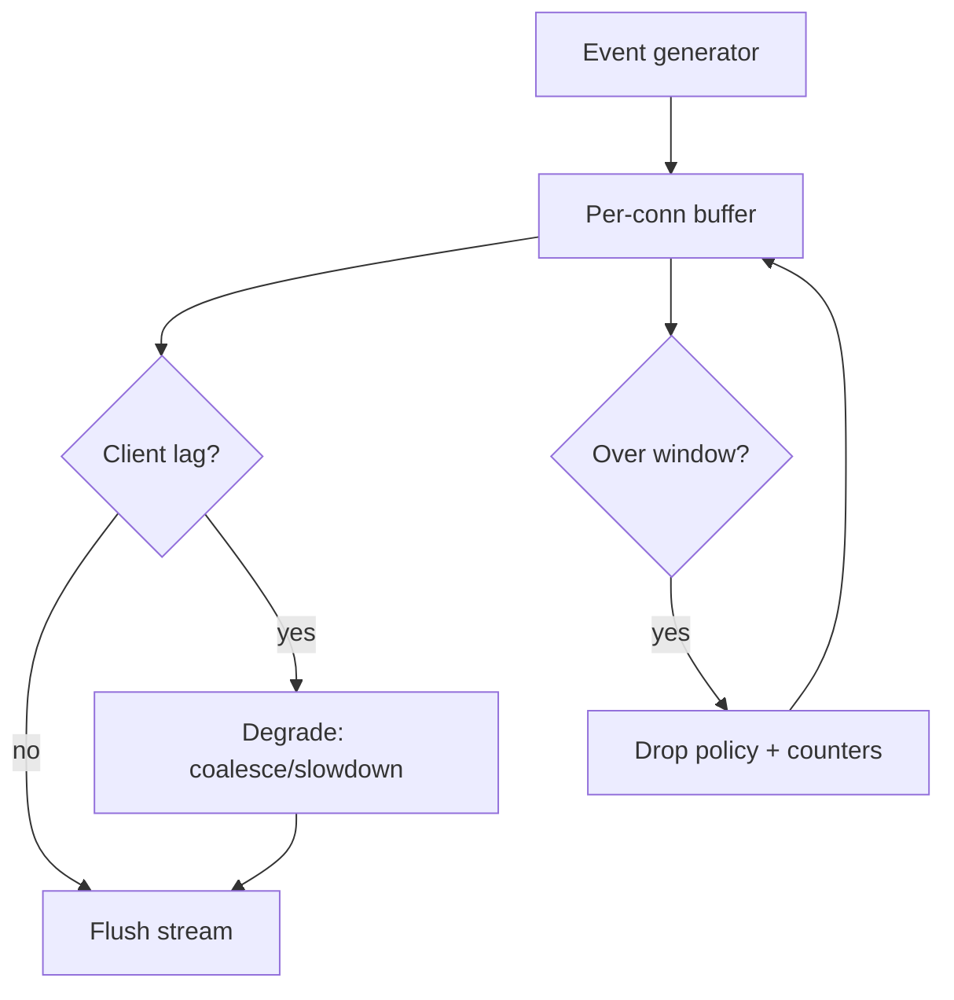

## Why

SSE 现在承载了越来越多的“实时感”：token 流、progress、shared_state patch、诊断事件。客户端侧我们已经在谈 coalescing 和节流（`c2135`），但服务端如果不做边界控制，仍会出现两个问题：

1) **慢客户端拖垮整体**：连接写不出去，缓冲越积越多，最后不是 OOM 就是延迟爆炸。
2) **事件量本身太大**：同样的信息，以更高频率、更大 payload 推送，网络和序列化成本会把“快”吃掉。

这份 change 想把服务端侧的缓冲、背压、压缩策略写成契约，让 SSE 成为可控通道，而不是性能黑洞。

## What Changes

- 定义 server-side event buffer window（和 `Last-Event-ID` 对齐）：
  - 缓冲条数/时间窗口的默认值
  - 超出窗口时的裁剪规则（必须可解释：丢了哪些 kind，为什么丢）
- 定义 slow-client backpressure 行为：
  - 检测写入滞后（socket backpressure / write queue）
  - 进入降级模式：降低 flush 频率、合并事件、必要时断开并给出可恢复 hint（对齐 `c2102`）
- 定义服务端 coalescing（与 `c2135` 的客户端 coalescing 对齐，但不相互依赖）：
  - token 类事件按时间片 flush
  - progress 类事件只保留最新
  - patch 类事件按批应用并保持最终一致性（对齐 `c2012`）
- 可选启用压缩（明确边界）：
  - 只对大 payload kind（例如 trace/timings）启用
  - 保持流式语义，不把 SSE 变成“攒一包再发”

## Capabilities

### New Capabilities

- `sse-server-side-buffering-backpressure-and-compression`: server buffer、背压与压缩策略的稳定契约。

### Modified Capabilities

- `sse-event-envelope-v2`（`c09`）：事件顺序/重连语义需要明确到能支撑 buffer window。
- `sse-event-schema-and-stream-client`（`c2007`）：新增“服务端裁剪/降级”的可诊断信号。
- `concurrency-budgets-and-backpressure-visibility`（`c39`）：SSE 也属于背压体系的一部分，不能只管 worker 队列。
- `observability-bundle-and-traceability`（`c12`）：事件裁剪/降级需要进入诊断字段，避免“看起来没事但其实丢了”。

## Impact

- Backend：需要把 SSE 写入从“尽量发”变成“按预算发”，并能解释降级。
- Frontend：遇到慢网络时不再无限卡死；能收到明确提示（比如“已降频以保持流畅”）。

