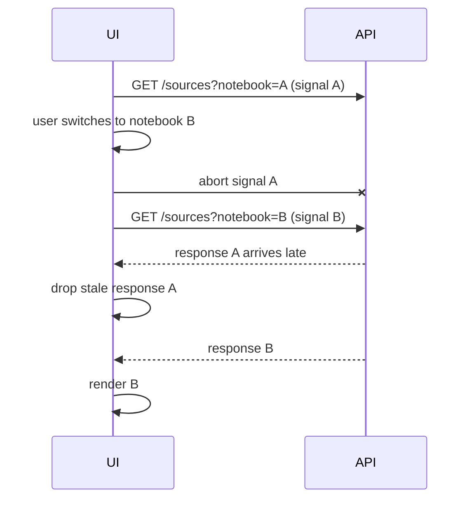

## Why

workspace 的交互节奏很快：切 notebook、切 panel、改筛选、开一个详情又立刻返回。现在很多请求会“跑完再说”，即使用户已经不在那个页面了。它带来的问题很实际：

- 白白占用网络和后端资源（尤其是大列表和详情）
- 旧请求晚到一步，覆盖新状态，引发闪烁或错误数据
- 主线程被无意义的 state update 打爆，INP 变差

我们需要把“请求的生命周期”收口：不再让过期的 inflight 工作继续消耗资源。

## What Changes

- 在 API client wrapper 中定义统一的取消语义（对齐 `c2103`）：
  - 所有 fetch 支持 `AbortSignal`
  - 取消必须映射成稳定的错误类型（不把它当成“失败”弹红字）
- 在 SWR/domain hooks 里定义 stale pruning：
  - scope 变更（notebook_id/session_id/collection_id）时，取消旧 scope 的 inflight 请求
  - mutation 后的 revalidate 也要可取消，避免 revalidate 风暴（对齐 `c2104`）
- 对 SSE/stream 也做同样的生命周期管理（对齐 `c2026`）：
  - 当 run/session 不再可见，取消订阅或降为低频
  - 确保不会出现“旧流把新 UI 顶掉”的情况（对齐 `c2012` 的幂等/合并契约）
- 增加轻量诊断计数：
  - aborted request 数、stale response dropped 数（进 `c2146` overlay / `c30` diagnostics）

## Capabilities

### New Capabilities

- `frontend-request-cancellation-and-stale-inflight-pruning`: 取消语义、stale pruning 规则与诊断计数。

### Modified Capabilities

- `frontend-api-client-wrapper-and-typed-errors`（`c2103`）：补齐 abort 的统一错误映射。
- `frontend-data-fetching-standardization-and-swr-adoption`（`c2104`）：domain hooks 迁移时必须使用统一取消策略。
- `frontend-sse-connection-multiplexing-and-resource-guards`（`c2026`）：流订阅的生命周期需要可控。
- `ui-event-idempotency-and-shared-state-merge-contract`（`c2012`）：旧事件/旧响应不得污染新状态。

## Impact

- UX：切换更稳、更不抖；弱网下也更像“我在控制它”，而不是“它在自己跑”。
- Backend：无意义请求减少，峰值压力更低。

