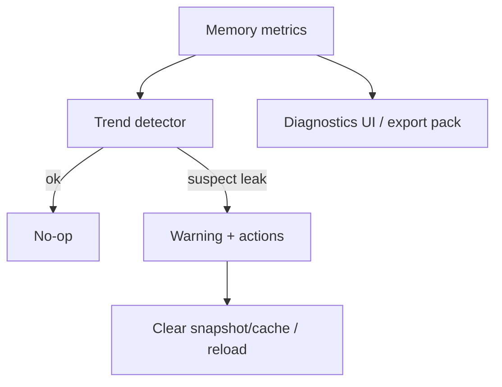

## Why

Crystalith 的使用很容易变成“开一天不关”：一直导 sources、一直跑 sessions、一直开着多个面板。只要有一点点缓存不收口，或者某个组件泄露订阅，内存就会慢慢涨，最后表现成：

- UI 越用越卡（不是某一次操作慢，是整体变钝）
- 低配机器直接崩（尤其是浏览器 tab 被 OS 杀掉）
- 后端也可能因为缓存/索引/事件 buffer 累积变胖

我们不需要把“内存管理”做成复杂系统，但需要一个最低限度的预算和自检，让问题尽早暴露。

## What Changes

- 定义 runtime memory budgets（v1 只做观察 + 提示，不做强制 kill）：
  - Frontend：JS heap（可得时）、SWR cache 大小、事件 buffer、渲染缓存
  - Backend：RSS、关键缓存（embedding/retrieval/context assembly）占用估计、SSE buffer 占用
- 引入 leak detectors（启发式即可）：
  - 观察“内存随时间单调上升且无回落”的趋势，并给出警告阈值
  - 给出可执行自救动作：清理本地快照（`c2140`）、清缓存 epoch（`c585`）、重载页面、重启服务
- 把内存摘要放进 diagnostics：
  - `c30` diagnostics UI 展示当前与近 10 分钟趋势
  - `c2126/c2142` 导出包里包含内存摘要与阈值触发信息

## Capabilities

### New Capabilities

- `runtime-memory-budget-and-leak-detectors`: 内存预算、趋势检测与诊断输出约定。

### Modified Capabilities

- `storage-and-cache-maintenance-tooling`（`c18`）：清理动作的入口需要更统一（不要散落在各处）。
- `dev-diagnostics-workbench`（`c30`）：新增内存面板与趋势摘要。
- `diagnostics-export-pack`（`c2126`）/`diagnostics-export-pack-with-perf-traces`（`c2142`）：导出包包含内存与泄露提示。
- `sse-server-side-buffering-backpressure-and-compression`（`c2145`）：SSE buffer 是内存预算的重要来源之一。

## Impact

- UX：长时间使用更稳，弱机器不再“莫名其妙卡死”。
- Engineering：能更快区分“正常变大”和“真的在泄露”。

