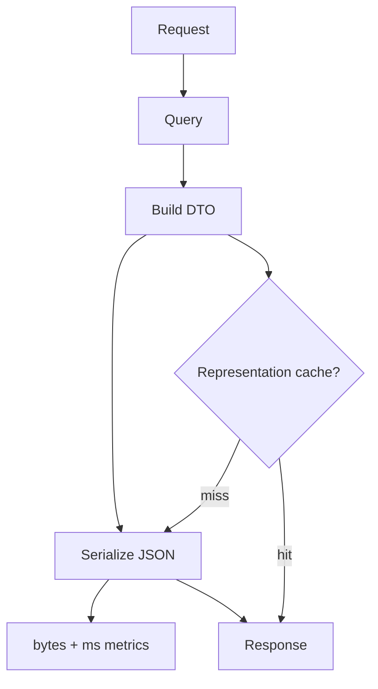

## Why

有些接口“看起来 DB 很快”，但用户还是觉得慢，原因常常在最后一步：JSON 序列化和响应体构建。尤其当 Pydantic/DTO 逐渐变复杂、字段越来越多时，序列化成本会悄悄占掉大头。

如果我们只盯 DB 慢查询（`c2137`）而不看序列化，就会出现一种错觉：数据拿得很快，但就是发不出去。

## What Changes

- 增加 response build/serialization metrics（默认 dev/local 开启）：
  - `serialize_ms`、`response_bytes`
  - 与 `correlation_id` 关联（对齐 `c2002`）
  - 输出到结构化日志与 diagnostics（对齐 `c2019`、`c30`）
- 为少数 read-heavy endpoints 引入“表示缓存”（representation cache）：
  - 以资源版本/ETag 为 key 缓存已序列化的 JSON bytes
  - 只用于明确无敏感字段、且字段集合稳定的 endpoint（与 `c2144` presets 对齐）
- 明确边界：
  - 不把它做成全局魔法缓存；v1 只覆盖 bootstrap/summary 这类收益最大的接口
  - 缓存必须受 profile/config 控制，并能在 diagnostics 里看见命中率

## Capabilities

### New Capabilities

- `backend-json-serialization-hotspot-metrics-and-caching`: 序列化耗时/字节数指标与表示缓存边界。

### Modified Capabilities

- `structured-logging-schema-redaction-and-error-sampling`（`c2019`）：确保指标可聚合且不会泄露内容。
- `http-response-caching-etag-and-client-cache-keys`（`c2139`）：ETag 与表示缓存的版本 key 需要对齐。
- `api-response-size-budgets-and-fieldset-presets`（`c2144`）：字段集合稳定后，表示缓存才安全可用。
- `dev-diagnostics-workbench`（`c30`）：新增“serialize hotspot”视图与 top endpoints 列表。

## Impact

- Backend：更容易定位“慢在序列化”的回归；并为 bootstrap/summary 提供一条低风险提速路径。
- Frontend：首屏更稳；304/ETag 命中时也更干净（减少无意义重建）。

