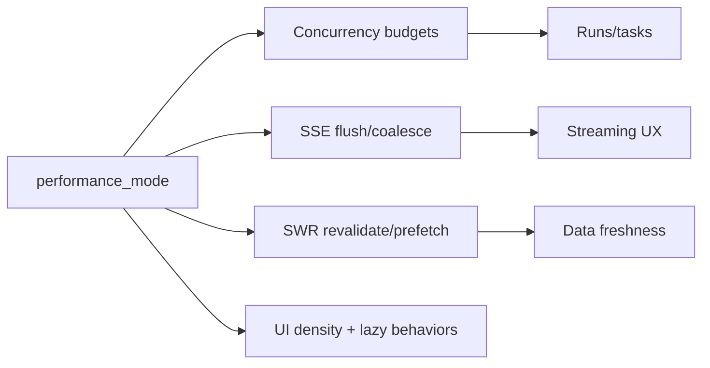

## Why

个人环境的“性能偏好”差异很大：有人用台式机希望更快，有人用笔记本希望更省电、更安静。我们已经在多个点引入了可调策略：

- 并发与背压（`c39`、`c2138`）
- SSE 事件合并与节流（`c2135`、`c2145`）
- revalidate/预取策略（`c2104`）
- UI 的 lazy mount、虚拟列表等（`c2133`、`c2134`）

如果这些策略各自都有开关，最后会变成“一个产品，十几个旋钮”，没人真的会调。更好的方式是：给一个少量档位的 mode，把常见策略打包成可理解的选择。

## What Changes

- 定义 `performance_mode`（v1 只提供 2~3 档）：
  - `quiet`：更少并发、更强节流、更少预取（适合笔记本/弱网）
  - `balanced`：默认
  - `fast`：更积极的并发与预取（适合桌面/强网）
- 约定 mode 的作用范围（先覆盖最关键链路）：
  - 并发预算默认值（对齐 `c39/c2138`）
  - SSE flush/coalesce 窗口（对齐 `c2135/c2145`）
  - SWR revalidate 频率与预取策略（对齐 `c2104`）
- 增加可见性：
  - UI 显示当前 mode，并能一键切换
  - diagnostics/export pack 记录 mode（对齐 `c30`、`c2126`）
- 红线：
  - mode 只能影响性能策略，不能改变业务语义（例如不能因为 quiet 就少检索一半证据，最多影响节奏和并发）

## Capabilities

### New Capabilities

- `performance-mode-toggle-and-safe-defaults`: mode 档位、默认值与映射规则。

### Modified Capabilities

- `config-profile-overlays-and-drift-guards`（`c14`）：mode 需要落到配置层并可被 overlay 覆盖。
- `concurrency-budgets-and-backpressure-visibility`（`c39`）/`profile-aware-resource-tuning-and-adaptive-concurrency`（`c2138`）：mode 与预算/自适应策略要能组合。
- `sse-event-coalescing-and-ui-update-throttling`（`c2135`）/`sse-server-side-buffering-backpressure-and-compression`（`c2145`）：mode 映射到节流窗口。
- `frontend-data-fetching-standardization-and-swr-adoption`（`c2104`）：mode 映射到 revalidate/预取策略。

## Impact

- UX：用户不需要懂一堆细节，也能得到符合自己设备的体感。
- Engineering：默认策略更容易收敛，讨论不会陷入“到底该默认开几并发”这种循环。

