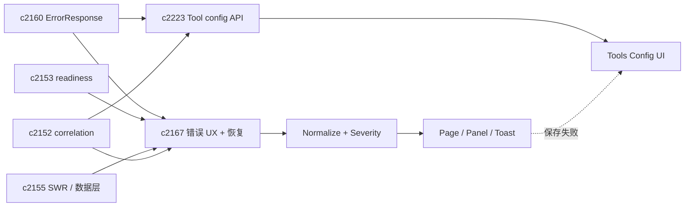
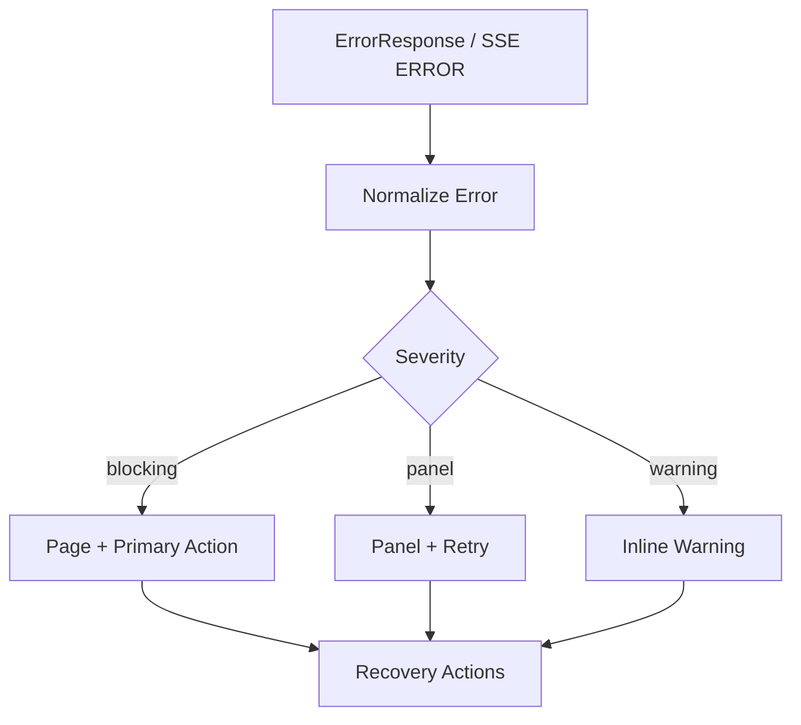
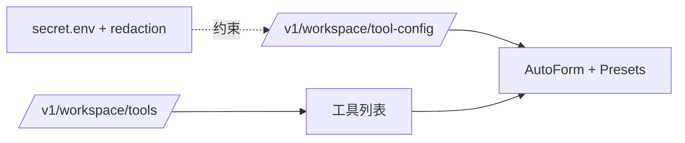

## Why

前端已串联 SSE、后台任务、检索与生成，但遇断线、超时、可选服务不可用时，体验易从「可控」掉到「无助」：页面卡住、提示模糊、不知下一步点哪。当存在可选服务、降级与可恢复失败时，最怕的是错误呈现不统一——同一问题长成十种样子，用户只剩一句「失败了」。

后端在统一错误模型（`ErrorResponse`）与 readiness 上已有基础；前端需收口：**同一错误码与 hint，在各面板一致呈现，并可直接触发恢复动作**。与此同时，`/v1/workspace/tools` 已能暴露工具列表与 schema，但**配置值**若只存在本地状态，会导致换浏览器/profile/刷新后「每次重新上手」；后端与前端也难约定「哪些配置影响生成」，诊断与复现成本高。把 **tool config** 提升为一等对象（可校验、可审计、可 redaction 的 secret），与统一错误面共用同一套分层 UI，才能把「工作台基础设施」一次做对。

> 合并说明：本提案合并了原 `workspace-tool-config-persistence-and-ui` 的全部内容。

## What Changes

1. **统一 error surface**：页面级阻断（primary action：重试/诊断/切换配置）；面板级局部失败；轻提示非阻断 warning；空态与半完成态提供明确下一步（与 `c3000` 首次成功路径一致）。
2. **错误分类与 UI 行动映射**：网络/断线（SSE reconnect、重试）；上游模型（换模型/降级/重试）；检索/存储（能力受限与恢复步骤）；校验/参数（字段级可操作提示）。
3. **统一展示数据源**：`ErrorResponse` 按 `error_code/message/hint/retry_after` 渲染；SSE error event 同套 UI（`c2155`/`c2006`）；展示/复制 `correlation_id`，一键进 diagnostics（`c2152`/`c2020`）。
4. **统一 recovery actions**：hint 收成可点击动作；`retry_after` 提供倒计时/禁用，避免狂点。
5. **SWR 层统一映射**：fetcher 归一 Error 对象；mutation 按 error_code 做 invalidation 或停止重试。（`c2155`）
6. **前端内部 BREAKING**：ad-hoc error UI 升级为统一组件与约定。
7. **`ToolConfig` 契约（workspace scope）**：`tool_id`；严格校验的 `config` JSON；**secrets** write-only（读取仅 `is_set`，永不回显明文）；`revision`、`updated_at`、`updated_by`、`correlation_id`。
8. **最小读写接口**：`GET /v1/workspace/tool-config` 批量；`PUT .../{tool_id}` 乐观并发；`POST .../{tool_id}:reset`；secret  omitted 不变、empty 清空语义明确。
9. **Secret 声明**：`PluginConfigSchema.secret_keys` 等；SourceConnector schema 对齐 `format: password` / `writeOnly` 与同一套 redaction。
10. **落盘红线**：SSOT `config/secret.env`；`tools.<tool_id>.<key>` 命名空间；日志/诊断包禁止明文 secret（`c2166`、`c2020`）；配置失败走 `ErrorResponse` 与可执行 hint。
11. **Tools Config UI**：左侧工具列表（`/v1/workspace/tools`），右侧编辑（tool-config API）；AutoForm 基于 `PluginConfigSchema`（克制）；**Presets**（同 tool 多套配置、diff-friendly、可回滚上一版本）。
12. **范围**：先不做跨设备同步；同一 workspace 内可记住即可。

## Capabilities

### New Capabilities

- `frontend-error-ux-and-recovery-actions`：错误呈现层级、分类、恢复动作与统一映射。
- `workspace-tool-config-persistence-and-ui`：tool config 模型、校验、读写、审计、统一配置 UI 与 presets。
- `tool-config-secrets-and-redaction`：secret 声明、读写、落盘与 redaction 红线。

### Modified Capabilities

- `openapi-error-contract-and-doc-gates`：错误体稳定供前端消费。（`c2160`）
- `optional-services-readiness-contract`：degraded/blocked 一致 UI 落点。（`c2153`）
- `request-context-and-correlation-ids`：correlation 贯穿 UI 与配置更新。（`c2152`）
- `frontend-swr-key-registry-and-invalidation`：SWR 与错误处理协同。（`c2155`）
- `dev-diagnostics-workbench`：错误卡片一键进诊断工作台。（`c2020`）
- `workspace-ui-core`：全局 error boundary、banner/toast 规范、页面级恢复；承载配置入口与 overlay 路由。
- `workspace-ui-panels`：面板级错误与重试/恢复入口统一。
- `workspace-shared-ui-state`：错误/恢复对共享状态的幂等影响。
- `chat-ui-envelope`：SSE 断线/重连与错误事件 UI。（`c2006`）
- `workspace-api-contract`：tools 与 tool config 组合输出稳定。
- `ui-event-idempotency-and-shared-state-merge-contract`：未来并发编辑沿用同一语义。（`c2161`）
- `structured-logging-schema-redaction-and-error-sampling`：redaction 覆盖 tool/connector config。（`c2166`）
- `config-profile-overlays`：secrets 来源与覆盖顺序可解释。（`c1000`）
- `frontend-error-ux-and-recovery-actions`（本变更内）：配置保存/校验失败一致呈现。（与原 c2223 引用合并）

## Impact

- **Frontend**：减少重复 error handling；工具配置入口统一、可复用表单；用户更少「只知道坏了」的时刻。
- **Backend**：错误码与 hint 更有价值；新增 tool config 存储与校验管道；OpenAPI 为 SSOT，`just api-export` / `just api-check` 与 `pnpm run api:sync` 照旧。
- **Risk**：错误若全做成大弹窗会打断工作——分层优先把阻断类做清楚，warning 克制。
- **Dependencies**：错误呈现与恢复可被 `c4061` 等 bundle fallback 提示复用。

## Dependency Sketch

