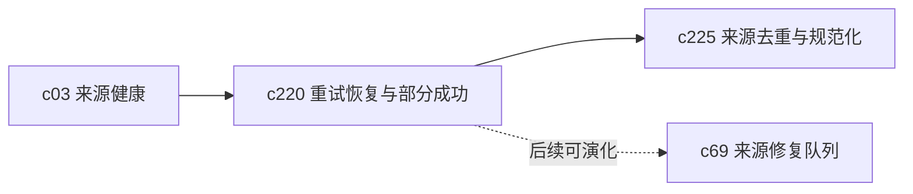

## Why

来源接入现在已经能跑起来，但一旦抓取链路里某一步失败，用户常常只能整条重试。对个人工作台来说，这种失败方式太粗了。真正需要的不是“成功或失败”两个结果，而是更细的恢复路径。

## What Changes

- 定义 source ingestion 的步骤级状态，区分抓取成功但解析失败、解析成功但索引失败、部分附件成功等常见情况。
- 引入 partial success 语义，让来源在部分可用时仍能进入工作台，只是带着明确的缺口提示。
- 支持按失败阶段重试，而不是默认整条 ingestion 全量重跑。
- 为用户暴露 retry reason、恢复建议和最近失败上下文，减少“我只知道它坏了”的黑箱感。

## Capabilities

### New Capabilities
- `source-ingestion-retry-recovery-and-partial-success`: 定义来源接入的步骤级重试、恢复和部分成功语义。

### Modified Capabilities
- `source-ingestion-core`: 需要把 ingestion 状态从单一结果扩展为阶段化结果。
- `source-ingestion-upload-and-url`: 上传和 URL 导入都需要支持阶段化失败与重试入口。
- `source-connectors`: 连接器来源需要补同步失败与恢复边界。
- `background-jobs-and-task-runtime`: 需要支持 ingestion 任务的阶段重入和局部重试。

## Impact

- Backend：会影响 ingestion job 状态机、重试策略、错误分类和恢复入口。
- Frontend：会影响 Sources 面板、来源详情、失败提示和重试交互。
- Dependencies：这条线承接 `c03-source-readiness-and-freshness-hub`，也会给 `c225` 的去重和规范化流水线提供更稳的输入。

