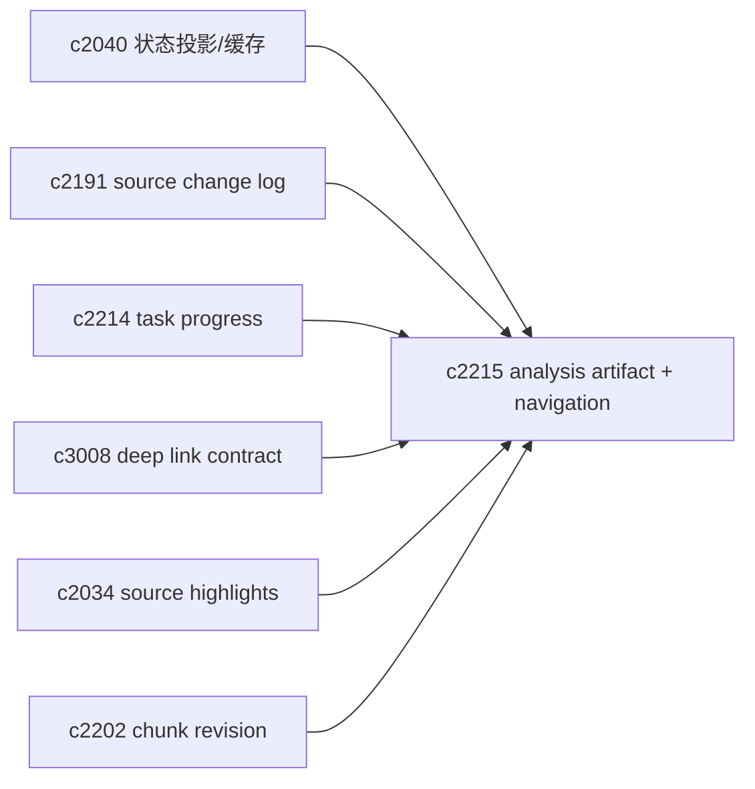
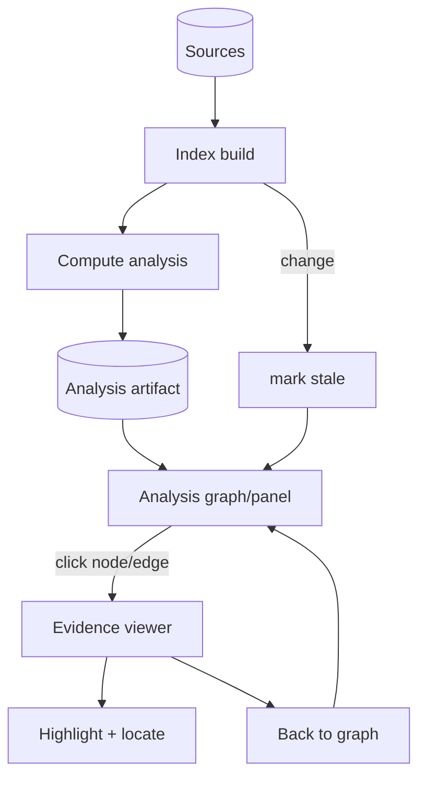

## Why

`/analysis` 现在是“现算现出”。当分析逻辑变复杂（聚类、关系、矛盾检测），它就会变成一个昂贵且不稳定的按钮：你点一次它跑一遍，刷新一下又跑一遍；来源一变，它又默默变得过期，但用户看不出来。

更自然的形态是把分析当成 notebook 的一种“产物（artifact）”：有版本、有生成时间、有基线，必要时可刷新，但不会随手就消失。

另外，分析如果只能“看一眼概览”而不能一键回证据，它就会变成一次性的烟花：看完你还是得自己去找 chunk/段落，心力成本很高，也很难形成稳定工作流。因此分析需要成为“导航工具”——图上的每一个节点/边都能把你带回证据，并且能回得来。

## What Changes

- 将 `AnalysisResult` 存为 notebook artifact：
  - `analysis_snapshot_id`、`generated_at`、基于的 `index_revision/source_snapshot`
  - 状态：fresh / stale / failed（失败也要留原因）
- 增加轻量缓存策略：
  - 同一基线重复请求直接返回 artifact
  - 来源/索引变化时标记 stale，但不强制重算（由用户决定什么时候刷新）
- 把“为什么分析不可用”说清楚：
  - 没有可用 chunk、索引未完成、模型不可用等，都走统一错误契约/错误码（对齐 `c2160`）
- 为 analysis 图建立 deeplink + 回链：
  - chunk 节点 → 来源查看器定位（页码/段落）并高亮（复用 `c2034` 的高亮/定位方向）
  - relation 边 → 双侧证据并排查看（对齐 `c2076` 的阅读模式方向）
  - 在证据查看器里能“一键回到这条边/这个 topic”
- 增加常用筛选：
  - 只看冲突、只看高相似、按 topic 聚合
- 把链接契约做成可复用组件：
  - 不止 analysis，后续 citations、timeline、briefing 都能复用同一套“证据定位”能力（对齐 `c3008` 的 deep link contract）

## Capabilities

### New Capabilities

- `analysis-as-artifact-and-cache`: 分析结果的产物化、缓存与过期语义。
- `analysis-graph-deeplinks-and-chunk-navigation`: 分析图到证据的深链与导航。

### Modified Capabilities

- `workspace-state-projection-and-summary-cache`（`c2040`）：artifact 需要进入状态投影。
- `source-change-log-and-delta-indexing-planner`（`c2191`）：判断 stale 的依据来自 source change log。
- `cross-panel-selection-and-deep-link-contract`（`c3008`）：深链契约需要覆盖 chunk 定位与回链。
- `citation-span-mapping-and-source-viewer-highlights`（`c2034`）：高亮能力复用到 analysis。

## Impact

- UX：分析结果可复用，刷新更可控；并且分析从“概览”变成“可用的导航工具”，更容易形成“看图→回证据→再刷新”的节奏。
- Backend：需要一个 artifact 存储与基线引用；但收益是减少重复计算与不确定性。
- Risk：需要处理“chunk 被重切分导致 id 变化”的情况；这依赖 `c2202` 的 revision 语义。

## Dependency Sketch

