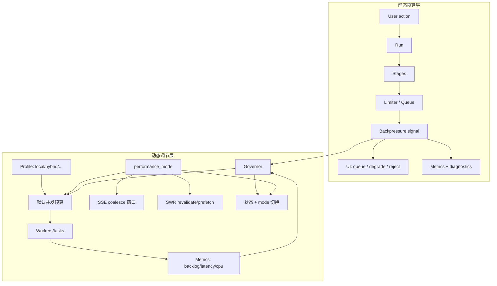

## Why

任务一多，系统不一定直接坏，但会先变得"有点堵"。真正难受的不是慢，而是不知道为什么慢、慢在谁前面、现在该不该再发一个任务。并发预算和背压如果一直藏在内部，用户和开发者都会猜，最后就是无意义重试把系统拖进雪崩。

同时，同一 Crystalith 在 local / hybrid / docker / full 下体感差异大；仅有静态并发预算仍易出现两极：小机器跑太猛（卡顿、发热），大机器又过保守。个人产品更需要**懂得收手的调度**：默认不折腾，负载变化时能自动调节。用户对性能偏好差异也很大：台式机要速度，笔记本要省电安静。

本提案把**并发预算与背压可见性**（静态契约层）和**资源调优与自适应并发**（动态调节层）统一为一条完整的资源管理链路。

> 合并说明：本提案合并了原 `concurrency-budgets-and-backpressure-visibility` 和 `performance-mode-toggle-and-safe-defaults` 的全部内容。

## What Changes

### 1. 并发预算（concurrency budgets）

- 按 stage（retrieval/embed/model/persist/export）设定并发上限与队列策略
- 区分全局预算、任务类型预算、来源/模型相关预算，避免一个重任务把所有东西一起拖死
- 对不同 profile 给出默认值

### 2. 背压可见性（backpressure visibility）

- API 暴露 limiter/queue 状态：队列深度、等待时间、拒绝/降级原因、预算摘要
- 背压信号回流到 run/task 详情、命令入口和生成前提示（不是只在日志里）
- 前端把"系统忙"的反馈做成可理解的提示，而不是纯转圈
- 明确背压下的行为（延迟/排队、降级、拒绝），给出明确原因与恢复动作

### 3. Profile-aware 资源档位

- 按 profile 给出 embedding/indexing/retrieval/generate 的默认并发预算
- 可选根据 CPU/内存做软调整（不追求精确，先避免离谱）

### 4. 自适应并发 governor（v1 极简）

- 观测 backlog、平均耗时、限流等待与 CPU 压力
- 在上下界内动态调节并发（如检索变慢时先降并发，保护外部依赖）
- 可见信号：通过 task phase note 或 backpressure UI 提示限流/降档

### 5. Performance mode（2～3 档）

- `quiet`（更少并发、更强节流、更少预取）/ `balanced`（默认）/ `fast`（更积极并发与预取）
- Mode 映射范围：并发预算默认值、SSE flush/coalesce 窗口、SWR revalidate 与预取
- 红线：mode 仅影响性能策略，不改变检索完整性等业务语义

## Capabilities

### New Capabilities

- `concurrency-budgets-and-backpressure-visibility`: 并发预算、背压信号、UI 反馈与降级/拒绝策略的契约。
- `profile-aware-resource-tuning-and-adaptive-concurrency`: 资源档位、governor 规则与可见信号。
- `performance-mode-toggle-and-safe-defaults`: mode 档位、默认值与映射规则。

### Modified Capabilities

- `background-jobs-and-task-runtime`: limiter/queue 统计输出与背压策略；调度支持动态并发调整。
- `generation-observability-and-guardrails`: 背压信号如何进入诊断与指标体系。
- `workspace-ui-core`: 前端对排队/降级/拒绝的用户提示与交互要求。
- `service-composition-profiles`: 不同 profile 下的默认预算与能力边界说明。
- `workspace-api-contract`: 增加队列状态与预算摘要接口。
- `config-profile-overlays-and-drift-guards`: 资源档位与 mode 落配置层。
- `task-phase-breakdown-and-progress-events`: 说清等配额/降档状态。
- `sse-event-coalescing-and-ui-update-throttling` / `sse-server-side-buffering-backpressure-and-compression`: mode 映射节流窗口。
- `frontend-data-fetching-standardization-and-swr-adoption`: mode 映射 revalidate/预取。

## Impact

- **Backend**：stage limiter 可解释输出；governor 与 mode 分层——mode 定策略包，governor 在包内细调。
- **Frontend**：用户更少无意义重试；更容易理解为什么慢；一键切换性能档位。
- **UX**：更少「机器被跑满」与「为什么慢」的挫败；用户不必理解细节也能匹配设备体感。
- **Dependencies**：建议先有 run 生命周期与观测字段，这样背压信号才能被准确归因与追踪。

## Dependency Sketch

