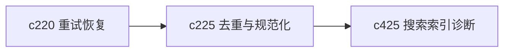

## Why

来源一多，真正烦人的不是“没有资料”，而是同一份资料进来好几次，标题、URL、抓取时间和格式还各不相同。没有稳定的去重和规范化，后面的搜索、分析和引用都会被噪声拖着跑。

## What Changes

- 定义 source canonicalization 流水线，把 URL、标题、正文指纹、附件关系和来源别名收口。
- 增加 dedup 语义，区分“完全重复”“近似重复”“同源不同版本”这些常见情况。
- 让去重结果既服务索引，也服务引用、搜索结果和来源管理，不只是后台清洗。
- 为用户保留可见的合并说明和误判回退入口，避免去重悄悄做错后难以修正。

## Capabilities

### New Capabilities
- `source-deduplication-and-canonicalization-pipeline`: 定义来源去重、规范化和合并边界。

### Modified Capabilities
- `source-ingestion-core`: 接入链路需要补规范化和去重阶段。
- `source-ingestion-management-and-tags`: 来源管理需要支持重复簇、主记录和回退。
- `knowledge-curation-and-freshness`: 去重后的主记录需要承接新鲜度评估。
- `retrieval-and-cache`: 检索和索引需要消费规范化后的来源标识。

## Impact

- Backend：会影响来源存储模型、指纹计算、合并策略和索引输入。
- Frontend：会影响 Sources 面板、重复提示、来源详情和管理动作。
- Dependencies：这条线建立在 `c220` 的阶段化恢复之后，也会继续抬高 `c425` 搜索诊断的可信度。

