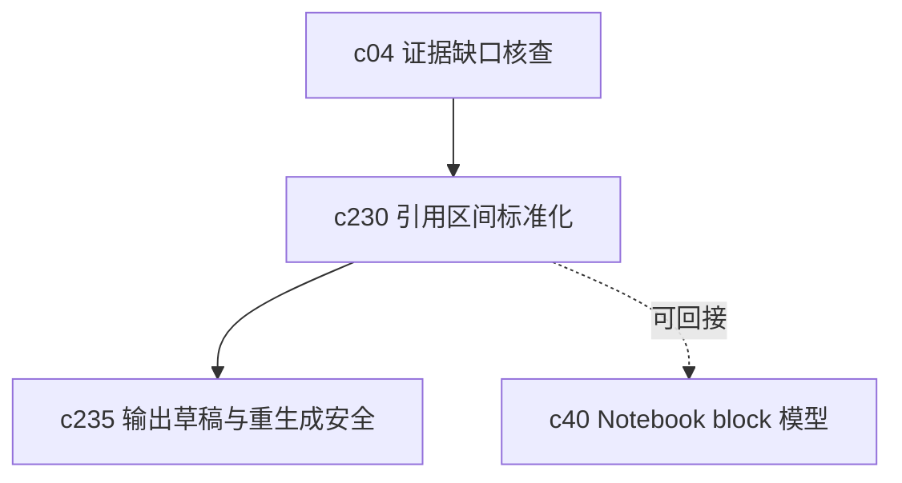

## Why

现在系统已经能给结果带引用，但引用在不同输出类型、重新生成、导出或 refine 之后，位置和锚点还不够稳。引用一旦飘，后面的审阅、复盘和导出都会开始别扭。

## What Changes

- 定义统一的 citation span 模型，把“引用覆盖的文本范围”和“引用指向的来源锚点”拆清楚。
- 增加 source anchoring 语义，让引用不只回到 source，而是尽量回到稳定片段、块或页内区间。
- 统一不同输出类型里的 citation 表示，减少 guide、briefing、timeline 之间的差异。
- 为后续 regenerate、export 和 notebook block 引用提供更稳的锚点基础。

## Capabilities

### New Capabilities
- `citation-span-normalization-and-source-anchoring`: 定义引用区间、来源锚点和跨输出类型的一致表示。

### Modified Capabilities
- `evidence-review-workflow`: 审阅流程需要消费更稳定的引用范围和锚点。
- `output-rendering-and-typing`: 输出载荷需要统一引用区间与锚点字段。
- `generation-core`: 生成后处理需要按统一模型装配引用。
- `workspace-api-contract`: 引用查询和跳转接口需要暴露稳定锚点。

## Impact

- Backend：会影响引用装配、来源片段映射、输出载荷和导出结构。
- Frontend：会影响 Citation popover、drawer、跳转和审阅标注体验。
- Dependencies：这条线既能补强 `c04-evidence-gap-and-claim-checking`，也会成为 `c235` 输出草稿与重生成安全的前置。

