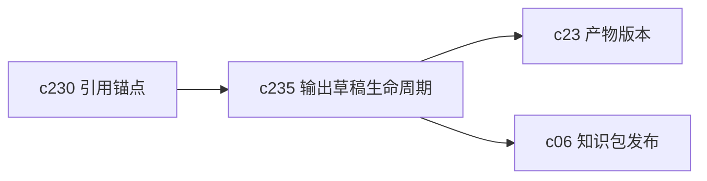

## Why

输出结果现在更像一次生成后的快照。用户一旦想重生成、局部调整、补引用或回退，系统很容易把“草稿”和“正式版本”混在一起。短期还能忍，结果多了以后就会开始乱。

## What Changes

- 定义 output draft lifecycle，区分草稿、待确认、已冻结、已替代等基础状态。
- 在 regenerate 前增加 safety guard，明确覆盖写、并行草稿、引用失效和差异提示语义。
- 支持草稿自动保存和显式确认，减少“改了一会儿结果被覆盖”的情况。
- 让 refine、export、versioning 和 publish 都能消费同一套输出状态，而不是各管一段。

## Capabilities

### New Capabilities
- `output-draft-lifecycle-and-regeneration-safety`: 定义输出草稿状态、重生成保护和确认边界。

### Modified Capabilities
- `publishable-artifacts`: 需要把草稿与正式产物区分开来。
- `studio-output-types`: 不同输出类型需要共享草稿与重生成语义。
- `output-rendering-and-typing`: 输出载荷需要带状态、差异和覆盖风险字段。
- `workspace-api-contract`: 需要提供草稿读取、确认、替代和回退接口。

## Impact

- Backend：会影响 output repo、生成任务回写、草稿状态存储和替代关系。
- Frontend：会影响 Studio 输出列表、查看器、导出按钮和二次生成流程。
- Dependencies：这条线承接 `c230` 的引用锚点稳定化，也和 `c23-artifact-versioning-and-release-channels` 能自然接上。

