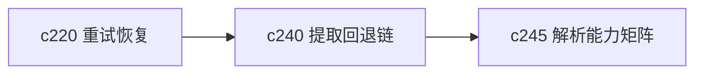

## Why

同一个 URL 在不同提取器下的结果可能差很多。现在提取失败或内容质量不好时，系统未必能清楚说明自己换了哪个提取器、为什么换、最后拿到的内容有多少折损。这个黑箱感会直接伤到信任。

## What Changes

- 定义 extractor fallback chain，明确提取器的尝试顺序、失败分类和切换条件。
- 为每次采集保留 capture provenance，记录最终用了哪个提取器、拿到了哪些关键字段、丢了哪些部分。
- 区分抓不到、抓不全、抓到了但质量一般，让来源状态更真实。
- 让提取 provenance 能回流到来源详情、重试恢复和搜索诊断，而不是只留在内部日志。

## Capabilities

### New Capabilities
- `extractor-fallback-chain-and-capture-provenance`: 定义提取回退链、采集 provenance 和质量折损说明。

### Modified Capabilities
- `source-ingestion-core`: 需要支持提取器尝试链和 provenance 回写。
- `web-extractor-plugins`: 需要明确提取器能力、失败类型和回退边界。
- `source-readiness-and-freshness`: 来源状态需要消费提取 provenance。

## Impact

- Backend：会影响提取流水线、失败分类、来源元数据和诊断字段。
- Frontend：会影响来源详情、提取说明和失败恢复入口。
- Dependencies：这条线能补强 `c220` 的重试恢复，也会和 `c245` 的解析能力矩阵连起来。

