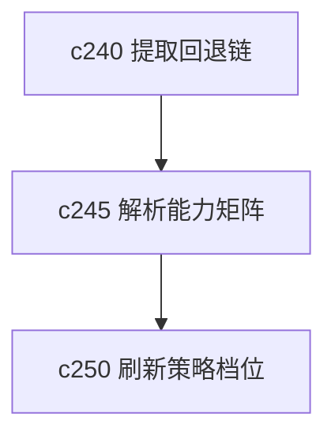

## Why

来源进来以后，真正出问题的地方常常不在抓取，而在解析。不同文件类型、媒体类型和边缘格式并不总有同样稳定的处理路径。现在如果解析结果怪，用户很难知道这是内容问题，还是解析能力本身就有限。

## What Changes

- 定义 parser capability matrix，明确各类 parser 能处理的格式、限制和已知降级路径。
- 增加 format fallback 语义，当首选 parser 不适合时，系统能解释回退到了什么方案。
- 区分“结构保真”“文本保真”“元数据保真”，避免只给一个笼统成功状态。
- 让解析能力矩阵回流到导入提示、失败恢复和来源详情。

## Capabilities

### New Capabilities
- `parser-capability-matrix-and-format-fallbacks`: 定义解析器能力矩阵、格式回退和保真度说明。

### Modified Capabilities
- `source-ingestion-summary-and-conversion`: 需要表达解析保真度和转换降级结果。
- `source-ingestion-core`: 需要把解析回退写回来源状态。
- `source-readiness-and-freshness`: 需要把解析保真度纳入 readiness 语义。

## Impact

- Backend：会影响 parser 注册、能力声明、保真度标记和错误分类。
- Frontend：会影响上传前提示、来源详情和失败说明。
- Dependencies：这条线承接 `c240`，也会成为 `c250` 自动复查策略的依据之一。

