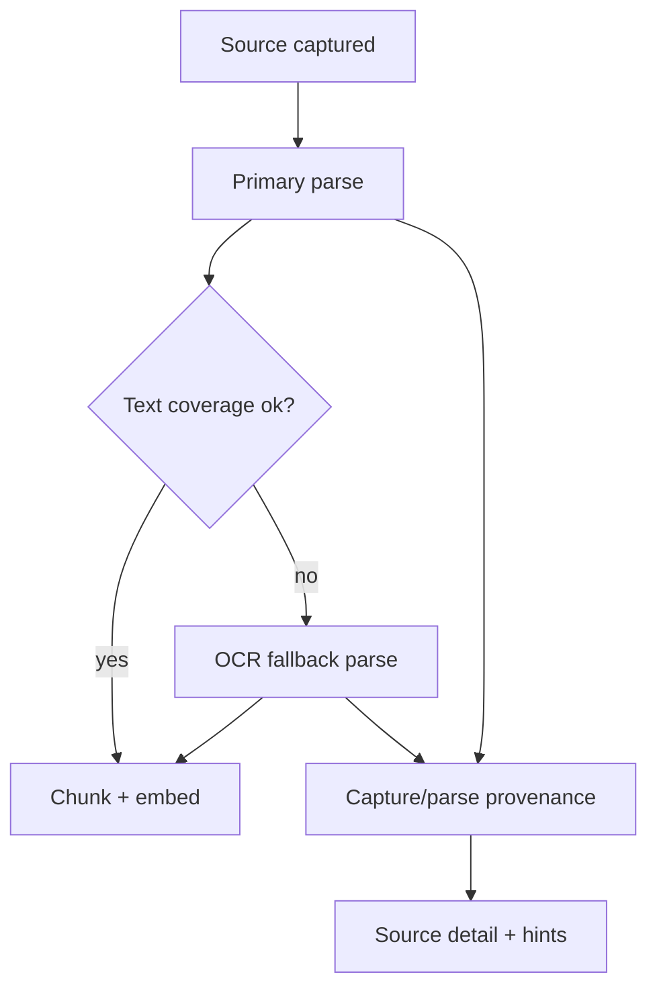

## Why

PDF 并不总是“有文字的 PDF”。有一大类资料是扫描件或图片拼出来的：看起来内容很全，但解析出来却是一片空白，或者只剩零碎的页眉页脚。对个人用户来说，这种体验很伤：你明明导进来了，却怎么也搜不到、也问不出来。

我们已经在补齐提取回退链（`c240`）和解析能力矩阵（`c245`），下一步应该把 OCR 明确纳入“可解释的回退路径”，而不是靠运气。

## What Changes

- 引入 OCR 作为一类 parser fallback：
  - 当 PDF/图片类来源的“文本覆盖率”低于阈值时，自动尝试 OCR。
  - 允许用户在来源详情里手动触发“运行 OCR”（避免误触导致资源浪费）。
- OCR 结果必须可解释：
  - 记录使用的 OCR 引擎/语言/页数范围/置信度与覆盖率，作为 provenance 写回来源。
  - 在来源详情显示“本来源使用了 OCR”的明显标记，并把“可能不准”的风险说清楚。
- OCR 要进入既有的 ingestion 流水线：
  - OCR 输出文本参与 chunking/embedding/retrieval，但需要和原始解析结果保留可追溯关系（同一 source 下的多个 text_variant）。
- 约定降级边界：
  - v1 不追求完美版式还原（表格/多栏先不做强承诺），先把“能搜、能引用”做稳定。

## Capabilities

### New Capabilities

- `ocr-fallback-for-scanned-pdf-and-images`: OCR 触发条件、回退语义、以及 provenance/置信度的最小字段集。

### Modified Capabilities

- `extractor-fallback-chain-and-capture-provenance`（`c240`）：提取 provenance 需要能表达“内容是图片型”的判断信号。
- `parser-capability-matrix-and-format-fallbacks`（`c245`）：把 OCR 作为明确的 format fallback，并写清保真度边界。
- `source-ingestion-core`：把 OCR 变成 ingestion 的一条可诊断分支，而不是隐藏实现细节。
- `official-plugins`：OCR 引擎建议以官方插件交付（core-only 不强拉重依赖）。

## Impact

- Backend：新增 OCR 回退步骤、provenance 写回、以及 text_variant 的持久化约定。
- Frontend：来源详情增加 OCR 状态/触发入口；导入后提示更准确（“解析为空 → 建议 OCR”）。
- Dependencies：建议接在 `c240`、`c245` 之后推进；并作为 `c247`（官方插件）的一条落地验证路径。

