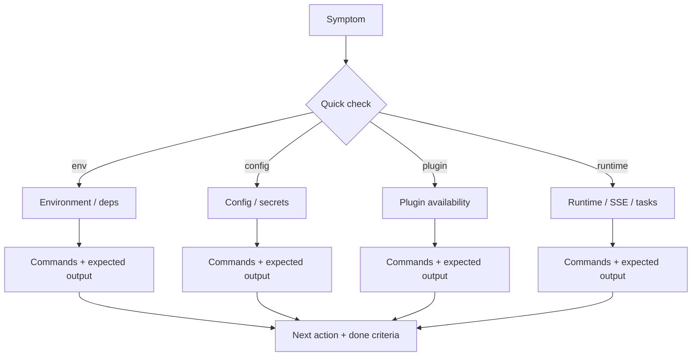

## Why

个人用户最容易被劝退的，不是功能不够，而是“第一次跑起来就遇到问题”。更糟的是：问题往往不是 bug，而是环境、插件、配置、可选服务的组合状态。没有一份靠谱的排障路径，大家只能在 issue 里来回贴日志。

我们其实已经在 specs 和 changes 里定义了不少诊断能力：startup self-test（`c1160`）、诊断工作台（`c525`）、diagnostics export pack（`c2126`）、correlation id（`c2002`）……缺的是把这些能力“翻译成普通人能用的排障手册”，并放到 docs-site 的显眼位置。

## What Changes

- 在 docs-site 增加一套 curated 的 Troubleshooting Hub（不把 openspec 目录直接当页面来源，遵循 `docs-site` 规范）：
  - 以“症状 → 快速判断 → 具体命令 → 可能原因 → 修复动作”的方式组织。
  - 每条问题都给出最短可执行命令（比如 `just status`、`just logs`、`just cleanup`、后端/前端常用检查入口）。
- 提供 Debug Recipes（可复制粘贴的排障脚本组合）：
  - 例如“导入失败但 UI 没提示”“SSE 卡住不动”“PDF 导入后搜不到”“connector sync_check 一直转圈”。
  - 明确什么时候需要 correlation_id，怎么取，怎么贴。
- 把 diagnostics export pack 变成“协作语言”：
  - 文档里写清导出包包含什么、怎么匿名化（对齐 `c2019` 的 redaction）、以及怎么在 issue 里上传。
- 给每条排障路线一个“结束条件”：
  - 我现在知道它是缺插件/缺依赖/配置错/外部服务挂了，并且有下一步动作。

## Capabilities

### New Capabilities

- `docs-troubleshooting-hub-and-debug-recipes`: 排障手册的结构、边界与更新约定（什么能写、什么不写）。

### Modified Capabilities

- `docs-site`：新增 Troubleshooting Hub 的 nav 与组织规则。
- `doc-governance`：排障手册属于 curated docs，需要有受控更新与 drift check。
- `quality-and-regression`：把“排障文档是否覆盖关键失败路径”纳入发布前 checklist（不作为硬 gate，但要可追踪）。

## Impact

- Docs：对用户最直接的收益是“少走弯路”，也能显著降低 issue 的往返成本。
- Engineering：文档会倒逼诊断能力的命名与输出更稳定（比如 error_code/hint 更一致）。
- Dependencies：建议优先与 `c1160`、`c525`、`c2126`、`c2102` 对齐术语，避免同一件事在不同地方叫不同名字。

