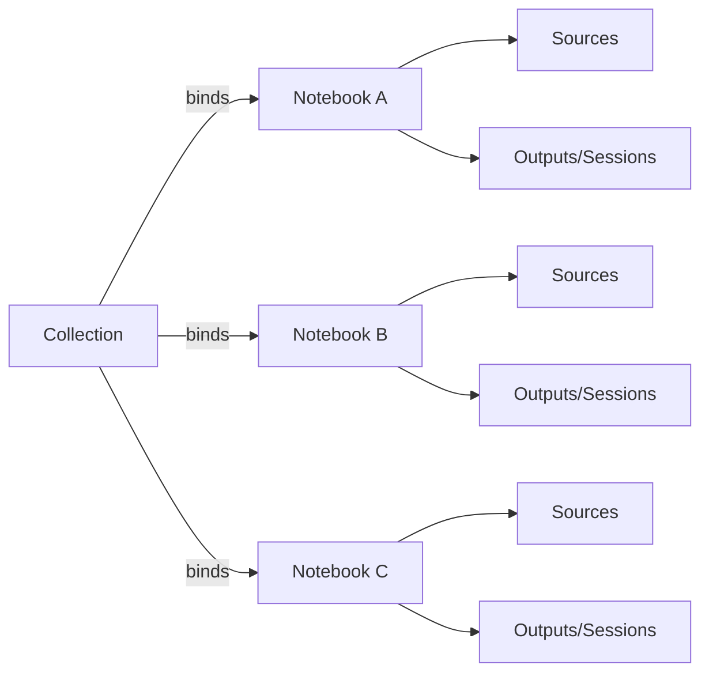

## Why

个人使用 Crystalith 时，notebook 往往不是“一本到底”。更常见的是：一个长期主题会拆成多个 notebook（读书笔记、项目资料、会议纪要、某个时间段的研究碎片）。等你真正要回答一个大问题时，又希望能在这些 notebook 之间自由检索、自由串联，但同时保留“这段内容属于哪个 notebook”的边界感。

`collection` 是一个很朴素的聚合层：它不替代 notebook，只是把一组 notebook 绑定成更大的工作上下文，让检索、导航和生成有一个“更像真实工作现场”的作用域。

这份提案直接对齐 `openspec/specs/multi-notebook-collections/spec.md`，先把 v1 的最小闭环做清楚。

## What Changes

- 引入 `collection` 实体（v1 只做平铺，不做层级/嵌套）：
  - `collection_id`、`name`、可选 `description`、绑定的 `notebook_ids`、`created_at/updated_at`。
- 提供 collection 的管理接口：
  - list / create / update / delete
  - add/remove notebook binding
- UI 增加 collection 的入口与最小导航：
  - 创建/编辑 collection
  - 从 collection 进入某个 notebook
  - 在 collection 下查看最近活动（先从“最近 outputs/sessions”做起）
- collection-scoped 检索与生成先不强行做完（交给 `c253` 承接），但 v1 需要把“作用域”概念落到 API 和 UI 路由上，避免后续再改。

## Capabilities

### New Capabilities

- `multi-notebook-collections`: collection 的对象模型、绑定关系与最小 API/UI 语义。

### Modified Capabilities

- `workspace-object-model-and-readiness`（`c00`）：需要把 collection 纳入对象模型与状态词汇（至少包含 empty/ready）。
- `workspace-api-contract`：新增 collection endpoints 与路由约定。
- `workspace-ui-core`：新增 collection 入口与导航装配。
- `data-and-storage`：新增 collection 与 notebook binding 的持久化模型（保持 notebook 身份不被吞掉）。

## Impact

- Backend：引入 collection 表/绑定关系；并把 notebook 查询扩展为 collection 视角的聚合查询（谨慎，v1 只做必要接口）。
- Frontend：新增 collection 页面/选择器；现有 notebook 路由需要能从 collection 深链回溯。
- Dependencies：建议引用 `c08-core-domain-object-model-and-id-conventions` 与 `c125-cross-panel-selection-and-deep-link-contract`，避免 collection 的 deep link 再发明一套语义。

