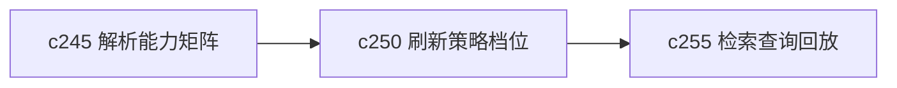

## Why

不是所有来源都该按同样节奏刷新。有些是一次性静态材料，有些是持续变化的页面，还有些是用户临时采集的快照。现在如果刷新策略太统一，就不是浪费资源，就是漏掉变化。

## What Changes

- 定义 source refresh policy profile，按来源类型、可信度和预期变化频率设置不同刷新档位。
- 支持 auto recheck，让来源在合适的时候自动进入轻量复查，而不是每次都全量重抓。
- 区分只检查头信息、只检查摘要变化和全量重抓三类策略。
- 让用户能看见当前来源为什么是这个档位，也能手动覆盖。

## Capabilities

### New Capabilities
- `source-refresh-policy-profiles-and-auto-recheck`: 定义来源刷新档位、自动复查和策略解释语义。

### Modified Capabilities
- `source-readiness-and-freshness`: 需要把刷新策略提升成正式用户可见能力。
- `knowledge-curation-and-freshness`: 需要消费刷新档位和复查结果。
- `background-jobs-and-task-runtime`: 需要支持轻量复查任务。

## Impact

- Backend：会影响刷新调度、轻量复查任务和策略存储。
- Frontend：会影响来源详情、策略选择和复查说明。
- Dependencies：这条线建立在 `c245` 的能力矩阵之上，也会给 `c255` 的检索回放提供更准确的来源时点信息。

