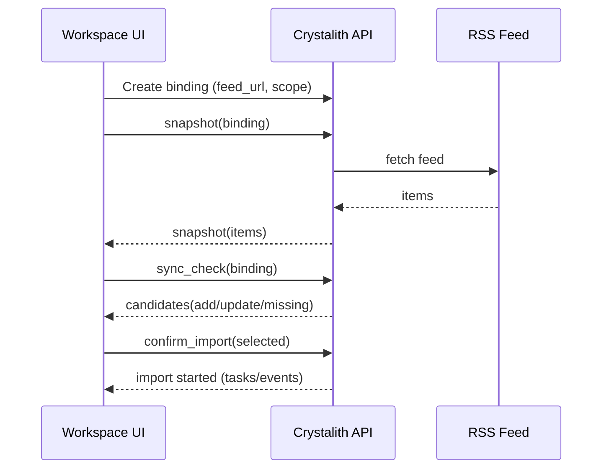

## Why

对个人用户来说，RSS/Atom 是非常“低摩擦”的资料入口：博客、项目更新、Newsletter 都能统一进一个 feed。现在我们已经有 connector 框架（`c2115`）和“快照优先 + 显式 sync_check”的语义，RSS 正好是一个成本不高、但价值很高的落地对象。

它还有一个好处：RSS 的增量语义天然清晰。只要把“上次确认过的条目”记下来，就能稳定给出新增/更新候选，不用做复杂的文件哈希。

## What Changes

- 新增 RSS/Atom connector（遵循 `source-connectors` 规范）：
  - `snapshot`：抓取 feed，返回条目列表（title/url/published_at/summary 等最小字段）。
  - `import_scope`：允许用户只导入最近 N 天、或只导入包含/不包含某些关键词的条目。
  - `sync_check`：对比 `last_confirmed_snapshot`，给出新增/更新候选，让用户确认后再导入。
- 导入策略（v1 先做简单稳定）：
  - 每个条目导入为一个 URL source（复用现有 URL ingestion + extractor fallback）。
  - 对重复 URL 做强去重（复用 `c225` 的 canonicalization）。
- 诊断与限速：
  - 明确区分“feed 本身不可用”和“某条 URL 抓取失败”。
  - 给出可执行 hint：重试、降低频率、切换 extractor。

## Capabilities

### New Capabilities

- `rss-source-connector-plugin`: RSS/Atom 连接器的 binding/snapshot/sync_check/import_scope 语义与最小字段集。

### Modified Capabilities

- `source-connectors`（`c2115`）：用 RSS 作为框架的“第二类非文件仓连接器”验证者。
- `source-ingestion-upload-and-url`：URL 导入需要能承接 connector 的批量导入入口。
- `extractor-fallback-chain-and-capture-provenance`（`c240`）：URL 抓取质量与 provenance 需要回流到 connector 的导入说明。
- `source-deduplication-and-canonicalization-pipeline`（`c225`）：RSS 导入时的 URL 去重会把这条链路推到日常路径里。

## Impact

- Backend：新增一个 connector 插件；并补齐批量 URL ingestion 的稳定入口。
- Frontend：复用宿主 connector UI；需要一个“条目预览 + 选择导入范围”的壳子渲染。
- Dependencies：强依赖 `c2115-source-connectors-framework`；建议与 `c250-source-refresh-policy-profiles-and-auto-recheck` 对齐“刷新频率”的默认策略。

