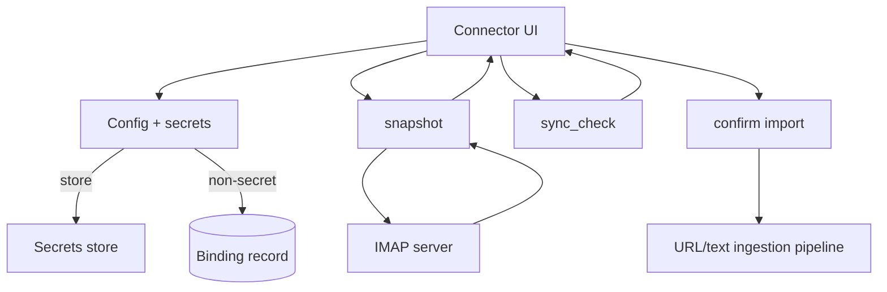

## Why

很多个人知识其实藏在邮箱里：Newsletter、会议纪要、重要通知、长邮件讨论。把这些内容变成可检索、可引用的 source，常常能立刻提升“我记得看过，但找不到”的解决概率。

我们已经有 connector 的“快照优先 + 显式 sync_check + 用户确认”的安全语义（`c2115`），IMAP 邮箱正好适合这套模型：先列出候选邮件，再让用户选择导入范围和导入方式。

## What Changes

- 新增 IMAP email connector（v1 只覆盖最小可用能力）：
  - 配置：server/port/ssl、username、认证信息、folders include、时间窗口（since）、最大拉取数量。
  - `snapshot`：列出邮件条目（subject/from/date/size/message_id），可选文本预览（长度受控）。
  - `import_scope`：按 folder + 时间范围 + 关键词过滤；导入时允许只选中部分邮件。
  - `sync_check`：基于 message_id 对比上次确认快照，给出新增候选（更新/缺失在 v1 可以只做解释，不做自动删除）。
- 安全与隐私边界：
  - connector binding 的认证信息不得以明文落库，必须走 secrets/加密存储，并在日志/诊断包中默认脱敏。
  - 文档明确提醒：邮箱导入属于高敏感来源，默认只在本地私有环境使用。

## Capabilities

### New Capabilities

- `imap-email-source-connector-plugin`: IMAP connector 的配置 schema、快照字段、以及导入边界。

### Modified Capabilities

- `source-connectors`（`c2115`）：IMAP 作为“需要 secrets 的连接器”验证者，推动框架把 secrets 处理做完整。
- `tool-config-secrets-and-redaction`（`c2122`）：连接器配置中的敏感字段需要有稳定的存储与脱敏策略。
- `structured-logging-schema-redaction-and-error-sampling`（`c2019`）：避免把 server/username/token 直接写进日志。
- `error-code-registry-and-api-error-shape-enforcement`（`c2102`）：把“认证失败/权限不足/连接超时”收口成可解释 error_code。

## Impact

- Backend：新增 IMAP connector 插件；补齐 secrets 持久化与 redaction 的落地路径。
- Frontend：复用 connector UI；需要更清晰的“这是高敏感连接器”的提示和确认流程（克制，不做复杂权限）。
- Dependencies：强依赖 `c2122-tool-config-secrets-and-redaction`；建议和 `c248` 的排障手册一起写清“安全导入”的注意事项。

