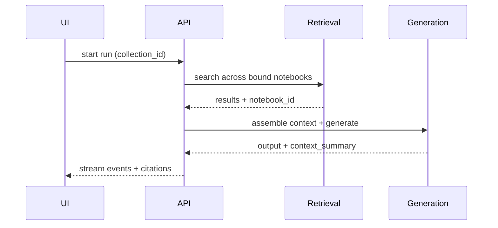

## Why

如果 collection 只是“把 notebook 放在一组里”，它的价值会很快见顶。真正的需求是：在 collection 的语境下检索、提问、生成，把“跨 notebook 的工作现场”变成默认能力，同时保持每条证据的 notebook 归属可追溯。

这份 change 是 `c249` 的自然后续：让 retrieval/context assembly/generation 都理解 collection 作用域，并把结果解释清楚（哪些 notebook 贡献了证据）。

## What Changes

- 扩展检索与生成请求，支持 `collection_id` 作为作用域参数：
  - 搜索：collection-scoped search 在绑定的 notebook 集合里工作，结果保留 `notebook_id`。
  - 生成：在 session/run 创建时允许指定 collection scope，后端按 scope 装配检索上下文。
- context assembly 需要做到两件事：
  - 去重：同一条来源/同一段内容不要因为跨 notebook 引用而重复进入 context（与 `c226`/`c225` 对齐）。
  - 可解释：输出“本次 context 来自哪些 notebook、各自贡献了多少证据”的摘要。
- UI 增加“在 collection 下提问/研究”的入口：
  - 一个明显的 scope 标签（避免用户以为只在当前 notebook 内检索）。
  - 在结果侧显示 notebook 归属（至少在 citations hover/sidecar 里可见）。

## Capabilities

### New Capabilities

- `collection-scoped-retrieval-and-generation`: collection scope 参数、context assembly 规则、以及可解释摘要字段。

### Modified Capabilities

- `multi-notebook-collections`（`c249`）：collection 需要明确“作为检索/生成作用域”的 API 入口。
- `retrieval-and-cache`：检索与缓存 key 需要纳入 collection 作用域，避免错用缓存。
- `retrieval-context-assembly-cache-and-metrics`（`c2008`）：context assembly 的缓存/指标需要扩展到 collection 维度。
- `generation-core`：run/session 创建与检索装配要能承接 collection scope。
- `workspace-ui-panels`：search/research/chat 面板需要能切换并展示 scope。

## Impact

- Backend：主要变更在检索装配与缓存键设计；要非常小心“跨 notebook 的泄漏”变成默认行为（必须显式 scope 才跨）。
- Frontend：需要一个清晰的 scope UI；避免“看起来像全局搜索但其实不是”的误导。
- Dependencies：强依赖 `c249-multi-notebook-collections-v1`；建议与 `c2008`、`c225`、`c230-citation-span-normalization-and-source-anchoring` 对齐引用与去重策略。

